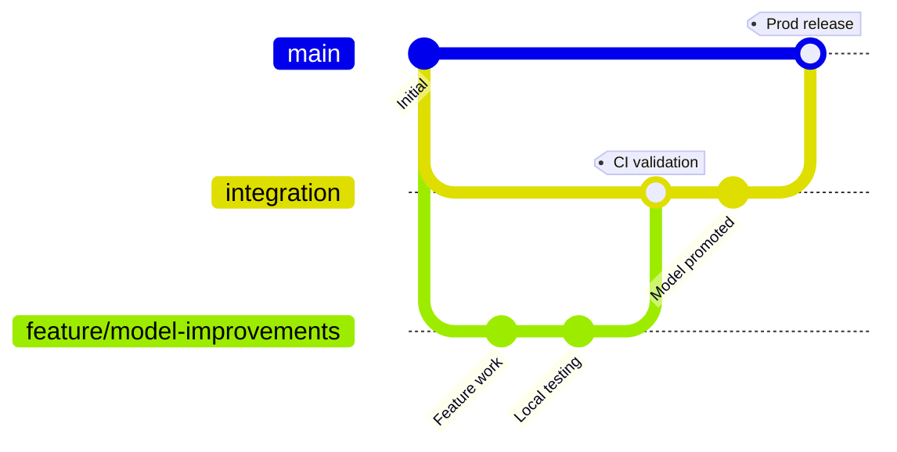

# Azure ML Platform & MLOps Workflow

End‑to‑end Azure Machine Learning platform (dev + prod) with an opinionated MLOps workflow: reproducible pipelines, model governance & promotion, private‑only networking, and centralized AML/Core Private DNS.

## Table of Contents

### Getting Started
- [Documentation Structure](#documentation-structure)
- [Platform Snapshot](#platform-snapshot)
- [Quick Infrastructure Deploy](#quick-infrastructure-deploy)
- [Repository Layout (High-Level)](#repository-layout-high-level)

### MLOps Workflow
- [MLOps Lifecycle](#mlops-lifecycle)
- [Components Overview](#components-overview-srccomponentsyaml)
- [Pipelines](#pipelines-pipelinesyaml)
- [Environments](#environments)
- [Notebooks](#notebooks-notebooks)
- [Asset Promotion Strategy & Cross‑Environment Access](#asset-promotion-strategy--crossenvironment-access)

### CI/CD & Development
- [CI/CD (Recommended Outline)](#cicd-recommended-outline)
- [Developer Inner Loop](#developer-inner-loop)
- [Source Code Highlights](#source-code-highlights)

### Architecture & Security
- [RBAC Snapshot (Operational)](#rbac-snapshot-operational)
- [Central AML & Core Service Private DNS](#central-aml--core-service-private-dns)
- [Network Security & Outbound Rules](#network-security--outbound-rules)
- [Verify After Apply (CLI)](#verify-after-apply-cli)

### Platform Management
- [Roadmap (Suggested Next Enhancements)](#roadmap-suggested-next-enhancements)
- [Changelog Pointer](#changelog-pointer)
- [Platform Limitations and Constraints](#platform-limitations-and-constraints)
- [Environment Promotion Behavior](#environment-promotion-behavior-images-and-components)

### CI/CD Implementation Details
- [Integration Branch ML CI/CD Plan](#integration-branch-ml-cicd-plan)
  - [Overview](#overview)
  - [Goals](#goals)
  - [Branching Strategy](#branching-strategy)
  - [CI/CD Architecture Diagram](#cicd-architecture-diagram)
  - [GitHub Configuration Prerequisites](#github-configuration-prerequisites)
  - [Security Considerations - Service Principal RBAC](#security-considerations---service-principal-rbac)
  - [Pipeline Stages](#pipeline-stages)
    - [Integration Pipeline Flow](#integration-pipeline-flow)
    - [Production Release Flow](#production-release-flow)
  - [Environment Usage](#environment-usage)
  - [Artifact Flow and Traceability](#artifact-flow-and-traceability)
  - [Operator Runbook Highlights](#operator-runbook-highlights)

### Infrastructure & Deployment Strategy
- [Architecture Overview](#architecture-overview)
  - [Key Architecture Features](#key-architecture-features)
  - [Service Principal Strategy](#service-principal-strategy)
  - [Network Security & Outbound Rules](#network-security--outbound-rules-1)
  - [Key Vault Configuration](#key-vault-configuration)
  - [Troubleshooting Quick Reference](#troubleshooting-quick-reference)
  - [Centralized Private DNS Strategy](#centralized-private-dns-strategy)
  - [Verification Commands](#verification-commands-from-bastion-jumpbox)
  - [Cost Considerations](#cost-considerations)
  - [Disaster Recovery](#disaster-recovery)
  - [Decision Log Highlights](#decision-log-highlights)

- [License](#license)

---

## Documentation Structure

**This README consolidates all documentation**:
- Quick start and MLOps workflow overview
- CI/CD implementation details
- Infrastructure architecture summary

**For detailed infrastructure deployment**, see:
- **[infra/README.md](infra/README.md)** - Complete Terraform deployment guide with step-by-step instructions

## Platform Snapshot
| Aspect | Implementation | Notes |
|--------|----------------|-------|
| Network | Flat dev/prod VNets + Bastion jumpbox | Bastion‑only access; no VPN/SSH; peering only for admin VM reachability
| DNS | Central shared Private DNS zones for AML and core services | api.azureml.ms, notebooks.azure.net, instances.azureml.ms, blob/file/queue/table/vaultcore/azurecr
| Workspaces | Dev & Prod (managed VNet, allowOnlyApprovedOutbound) | Private endpoints only; publicNetworkAccess disabled
| Registries | Dev & Prod (for promotion demo; single registry viable) | System‑assigned MI; private‑only
| Identities | UAMI per workspace + UAMI per compute | Workspace UAMI for connectivity; compute UAMI for data/registry
| Security | RBAC + private endpoints (no public ingress) | Least privilege; management‑ vs data‑plane separation
| IaC | Terraform modules (`infra/`) | Single service principal orchestrates
| Data | Sample taxi dataset (`data/`) | Expandable pattern

Deterministic naming: names derive from `prefix`, `purpose`, `location_code`, `naming_suffix`; no random postfixes. Last Updated: 2025‑08‑09.

## Quick Infrastructure Deploy
```bash
cd infra
terraform init
terraform plan
terraform apply
```
Configure `infra/terraform.tfvars` (purpose, location, address spaces, tags). See “Architecture & Security” below for full details.

---
## Repository Layout (High-Level)
```
infra/                Terraform root & modules
src/                  Component source code (Python)
	transform/          Feature engineering
	train/              Model training
	compare/            Champion vs candidate evaluation
	register/           Conditional model registration
	score/              Batch scoring / evaluation
	deploy/             (Future) Endpoint deployment logic
	predict/            Ad‑hoc / real-time inference sample
	components/*.yaml   Component specs (command, IO, env)
pipelines/            Pipeline job YAML definitions
environment/          Conda / requirements for train + score
notebooks/            Exploration & asset sharing demos
data/                 Sample taxi CSV + metadata YAML
infra/                Architecture, security, DNS, RBAC (consolidated here)
```

---
## MLOps Lifecycle
| Phase | Goal | Source | Outputs | Automation |
|-------|------|--------|---------|------------|
| Ingest & Profile | Land raw data | `data/raw` | Cleaned dataset | External / manual (future ingestion pipeline)
| Feature Engineering | Deterministic features | `transform.py` | Transformed asset | Pipeline step
| Training | Train new model | `train.py` | Model artifact + metrics | Pipeline step
| Evaluation | Compare vs baseline | `compare.py` | Pass/Fail + champion flag | Pipeline gating
| Registration | Persist approved model | `register.py` | Model version (registry/workspace) | Conditional
| Scoring | Batch / evaluation run | `score.py` | Scored outputs + eval metrics | On demand / scheduled
| Promotion | Make model consumable across envs | Registry versions | Manual / governed
| Deployment | Serve model (future) | Endpoint / batch job | CD (future)
| Monitoring | Detect drift / decay | Metrics store | Retrain trigger | Scheduled (future)

---
## Components Overview (`src/components/*.yaml`)
| Component | Purpose | Key Outputs |
|-----------|---------|-------------|
| transform | Clean & feature engineer raw taxi data | transformed asset path |
| train | Train model & log metrics | model artifact (e.g. pkl), metrics JSON |
| compare | Compare candidate vs production baseline | decision flag (register? yes/no) |
| register | Register model + metadata | model version in registry/workspace |
| score | Batch score / evaluate model | scored dataset, eval metrics |
| deploy | (Future) Build + push for endpoint | deployment asset |
| predict | Simple inference script | predictions |

Design principles: Single responsibility, composable, environment‑agnostic (environment pinned in YAML), minimal side effects, deterministic outputs.

---
## Pipelines (`pipelines/*.yaml`)
| File | Flow | Notes |
|------|------|-------|
| `taxi-fare-train-pipeline.yaml` | transform → train → compare → conditional register | Core training & governance pipeline |
| `single-step-merge-job.yaml` | Simple component validation | Useful for quick registry tests |

Submit (dev workspace example):
```bash
az ml job create \
	--resource-group <rg-dev-ws> \
	--workspace-name <dev-workspace> \
	--file pipelines/taxi-fare-train-pipeline.yaml
```

Promotion gating implemented inside `compare.py` (add thresholds / metric logic). Registration only occurs when the compare step signals improvement or policy compliance.

---
## Environments
| Path | Purpose | Usage |
|------|---------|-------|
| `environment/train/conda.yaml` | Build & train runtime | transform / train / compare / register |
| `environment/train/additional_req.txt` | Extra pip deps | Merged at image build |
| `environment/score/conda.yaml` | Lean inference runtime | score / predict |
| `notebooks/conda.yaml` | Interactive dev kernel | Local experimentation |

Recommendation: Promote curated environments into registry for reproducibility (future enhancement: environment registration pipeline + version tagging).

---
## Notebooks (`notebooks/`)
* Exploration & debugging (e.g., registry sharing demo)
* Prototype logic before extracting to component code
* Use consistent environment spec for reproducibility

Workflow: Prototype → Hardening (src/*) → Component YAML → Pipeline → Registry asset.

---
## Asset Promotion Strategy & Cross‑Environment Access
This repo intentionally uses two registries (dev, prod) to demonstrate promotion; most prod deployments can use a single org registry.

RBAC essentials:
- Dev compute UAMI: full access in dev (Workspace Data Scientist, Storage Blob/File Contributor, KV Secrets User, AcrPull/AcrPush, Registry User on dev registry); no prod access.
- Prod compute UAMI: prod access (same roles at prod scopes) plus read‑only AzureML Registry User on the dev registry for consuming promoted assets.
- Workspace UAMIs: do not get AzureML Registry User. They are connectivity actors only and require Azure AI Enterprise Network Connection Approver at the registry scope to enable managed private endpoints via outbound rules.

Network essentials:
- Workspaces run in managed VNets with isolationMode “AllowOnlyApprovedOutbound”.
- Outbound rules to registries must set destination.subresourceTarget = "amlregistry".
- Azure ML auto‑creates managed private endpoints in the managed VNet; no manual PE or DNS steps.

Promotion outline:
1. Dev pipeline registers model version in the Dev registry.
2. Governance (compare.py + manual gate) approves.
3. Promote to Prod registry (copy/reference) for consumption.
4. Prod consumes explicit version or approved tag.

Enhancements (future): tagging (`staging`, `prod`), automated rollback, multi-metric policy, bias/fairness checks.

---
## CI/CD (Recommended Outline)
| Stage | Trigger | Action |
|-------|---------|--------|
| Infra | Manual / tagged release | Terraform plan/apply
| Lint/Test | PR | Pytest + static analysis (add ruff/mypy)
| Component Build (optional) | Merge to main | Pre-build environment images
| Train Pipeline | Schedule + on-demand | Submit training job (dev)
| Promotion | Manual approval | Registry copy/tag
| Deploy | After promotion | Endpoint / batch job creation (future)

Sample (conceptual) GitHub Action step:
```yaml
- name: Submit training pipeline
	run: az ml job create --file pipelines/taxi-fare-train-pipeline.yaml \
			 --resource-group ${{ env.RG_DEV }} --workspace-name ${{ env.WS_DEV }}
```

---
## Developer Inner Loop
```bash
git pull
conda env create -f environment/train/conda.yaml -n aml-train || conda env update -f environment/train/conda.yaml -n aml-train
conda activate aml-train
python src/train/train.py --help  # local dry-run (mock input paths)
az ml job create --file pipelines/taxi-fare-train-pipeline.yaml ...
az ml job show --name <job-id>
```

---
## Source Code Highlights
| Script | Role |
|--------|------|
| `src/transform/transform.py` | Cleans & engineers taxi features |
| `src/train/train.py` | Trains model + logs metrics |
| `src/compare/compare.py` | Evaluates candidate vs baseline & sets register decision |
| `src/register/register.py` | Registers model (metadata, version) |
| `src/score/score.py` | Batch scoring / evaluation |
| `src/deploy/deploy.py` | Placeholder for future endpoint deployment |
| `src/predict/predict.py` | Lightweight inference utility |

---
## RBAC Snapshot (Operational)
| Principal | Scope | Roles (selected) |
|-----------|-------|------------------|
| Deployment SP | Env + Shared DNS RGs | [Contributor](https://learn.microsoft.com/azure/role-based-access-control/built-in-roles#contributor), [User Access Administrator](https://learn.microsoft.com/azure/role-based-access-control/built-in-roles#user-access-administrator), [Network Contributor](https://learn.microsoft.com/azure/role-based-access-control/built-in-roles/networking#network-contributor) |
| Workspace UAMI | Workspace RG + Registries | [Azure AI Administrator](https://learn.microsoft.com/azure/role-based-access-control/built-in-roles/ai-machine-learning#azure-ai-administrator), [Azure AI Enterprise Network Connection Approver](https://learn.microsoft.com/azure/role-based-access-control/built-in-roles/ai-machine-learning#azure-ai-enterprise-network-connection-approver), [Storage Blob Data Owner](https://learn.microsoft.com/azure/role-based-access-control/built-in-roles/storage#storage-blob-data-owner), [Key Vault Reader](https://learn.microsoft.com/azure/role-based-access-control/built-in-roles/security#key-vault-reader)/[Secrets User](https://learn.microsoft.com/azure/role-based-access-control/built-in-roles/security#key-vault-secrets-user) |
| Compute UAMI | Workspace + Data + Registries | [AzureML Data Scientist](https://learn.microsoft.com/azure/role-based-access-control/built-in-roles/ai-machine-learning#azureml-data-scientist), [Storage Blob Data Contributor](https://learn.microsoft.com/azure/role-based-access-control/built-in-roles/storage#storage-blob-data-contributor)/[Storage File Data Privileged Contributor](https://learn.microsoft.com/azure/role-based-access-control/built-in-roles/storage#storage-file-data-privileged-contributor), [Key Vault Secrets User](https://learn.microsoft.com/azure/role-based-access-control/built-in-roles/security#key-vault-secrets-user), [AzureML Registry User](https://learn.microsoft.com/azure/role-based-access-control/built-in-roles/ai-machine-learning#azureml-registry-user) |

Notes:
- Workspace UAMI also needs Key Vault Reader (management plane) and Key Vault Secrets User (data plane) on the workspace Key Vault to avoid 403 vaults/read during provisioning.
- Compute UAMI handles data and registry access; Workspace UAMI handles connectivity and approvals only.

---
## Central AML & Core Service Private DNS
Centralize these zones in a shared DNS RG and link both dev and prod VNets:
- AML: privatelink.api.azureml.ms, privatelink.notebooks.azure.net, instances.azureml.ms
- Core: privatelink.blob.core.windows.net, privatelink.file.core.windows.net, privatelink.queue.core.windows.net, privatelink.table.core.windows.net, privatelink.vaultcore.azure.net, privatelink.azurecr.io

Record coexistence: Dev and Prod records are prefixed by resource names and do not collide. Keep prevent_destroy on shared zones if you want protection.

Validation examples (from Bastion‑connected jumpbox):
```bash
nslookup <dev-workspace>.<region>.api.azureml.ms
nslookup <prod-workspace>.<region>.api.azureml.ms
nslookup <dev-workspace>.<region>.notebooks.azure.net
```

## Network Security & Outbound Rules
- Public network access is disabled for workspaces, registries, storage, key vaults, and ACR.
- Workspaces use managed VNet (approved outbound only) with user‑defined outbound rules for registries.
- Required shape (azapi): destination.serviceResourceId = registry ID and destination.subresourceTarget = "amlregistry".
- Create rules after assigning the Workspace UAMI the Azure AI Enterprise Network Connection Approver at the target registry scope; wait ~90–150s for RBAC propagation.

Note on registry pre‑authorization workaround: To prevent permission errors when Azure ML creates the managed private endpoint to a registry in private‑only setups, the registry is configured with `properties.managedResourceGroupSettings.assignedIdentities` to include the deployment principal’s objectId. This effectively grants Azure AI Administrator permissions over the registry’s Microsoft‑managed resource group so the platform can read needed metadata. See `infra/README.md` for verification commands.

Troubleshooting summary:
- 403 vaults/read during workspace create → add Key Vault Reader to Workspace UAMI.
- 409 FailedIdentityOperation after delete → add 150s slot wait before re‑create.
- 400 ValidationError on outbound rule → ensure subresourceTarget = "amlregistry".

## Verify After Apply (CLI)
PowerShell examples (Windows Bastion jumpbox). Expect:
1) Registry managed RG pre‑authorization shows your deployment SP in managedResourceGroupSettings.assignedIdentities[].
2) Outbound rules exist on dev and prod workspaces (including prod→dev).
3) Managed private endpoints exist in workspace managed RGs targeting registries with subresource "amlregistry".
4) Private‑only posture for Storage, Key Vault, ACR.
5) RBAC at registry scopes: Workspace UAMI (Approver) and Compute UAMI (Registry User).
See `infra/README.md` for exact commands.

---
## Roadmap (Suggested Next Enhancements)
* Environment artifact registration & reuse
* Automated drift detection + retrain trigger
* Endpoint deployment (blue/green or canary) automation
* Quality gates (test + lint) in CI
* Model tags & approval workflow
* Security scanning (supply chain / dependencies)

---
## Changelog Pointer
Key recent changes: Key Vault RBAC fix (add Reader + Secrets User), outbound rule shape requires subresourceTarget, centralized AML/Core DNS.

## Platform limitations and constraints
- Managed virtual network limitations impact asset operations:
	- Components cannot be shared from workspace to registry; recreate from version control in target workspace.
	- Private registries cannot build environments directly when ACR public access is disabled. Use one of:
		- Reference environments from the dev registry in production via azureml://registries/<dev-reg>/environments/...
		- Recreate environments in the prod workspace using the same image URI from the dev environment metadata.
	- Azure ML Studio shows only MODEL assets under network isolation; use CLI/SDK for other asset types.
	- For secure workspace→registry sharing, the workspace storage must allow Selected networks and include the registry under Resource instances (this repo configures it automatically).

## Environment promotion behavior (images and components)
- Docker environments shared to a registry build an image that lives in the source registry’s ACR; promoting to another workspace reuses the same image URI. The image is not copied to the prod registry ACR.
- Components are not shareable across workspaces/registries; store their YAML in version control and recreate in the target workspace.
- Practical guidance and code examples are available in `notebooks/asset_sharing/sharing_assets_registries_workspaces.ipynb`.

---

# CI/CD Implementation Details

## Integration Branch ML CI/CD Plan

### Overview

This CI/CD implementation provides automated model validation, promotion, and deployment across environments with quality gates at each stage. The workflow ensures only validated models reach production through a structured promotion path.

```
┌─────────────┐     ┌──────────────┐     ┌─────────────┐
│   Feature   │────▶│ Integration  │────▶│    Main     │
│   Branch    │     │    Branch    │     │  (Production)│
└─────────────┘     └──────────────┘     └─────────────┘
      │                    │                     │
      │                    │                     │
      ▼                    ▼                     ▼
   Local Dev        CI Validation          Prod Deploy
                    + Model Quality
```

### Goals
- **Standardize CI/CD**: End-to-end automation with explicit integration branch validation
- **Quality Gates**: Only model improvements (measured by comparison metrics) progress to production
- **Automated Testing**: Unit tests and ML pipeline validation run automatically for changes in `src/`
- **Environment Separation**: Clear boundaries between Dev workspace (experimentation), Dev registry (promotion gate), and Prod workspace (serving)
- **Traceability**: Complete audit trail from code commit to production model

### Branching Strategy



| Branch | Purpose | Notes |
|--------|---------|-------|
| `feature/*` | Individual feature work | Developers branch from latest `integration` |
| `integration` | Shared validation branch | All merges land here after validation |
| `main` | Production-ready | Only updated when prod deployment succeeds using validated artifacts |

**Workflow**:
1. Developer creates `feature/*` branch from `integration`
2. After local testing, PR to `integration` triggers CI validation
3. CI runs tests, training, model comparison
4. If quality gates pass, model promoted to Dev registry
5. Manual approval gates PR from `integration` to `main`
6. Merge to `main` triggers production deployment

### CI/CD Architecture Diagram

```
┌─────────────────────────────────────────────────────────────────────────┐
│                         GitHub Repository                                │
│  ┌──────────────┐    ┌──────────────┐    ┌──────────────┐             │
│  │   feature/*  │───▶│ integration  │───▶│     main     │             │
│  └──────────────┘    └──────────────┘    └──────────────┘             │
└──────────┬────────────────────┬────────────────────┬────────────────────┘
           │                    │                    │
           │                    ▼                    ▼
           │          ┌─────────────────┐  ┌─────────────────┐
           │          │ Integration CI  │  │  Prod Release   │
           │          │   Workflow      │  │    Workflow     │
           │          └─────────────────┘  └─────────────────┘
           │                    │                    │
           │                    │                    │
┏━━━━━━━━━┷━━━━━━━━━━━━━━━━━━━┷━━━━━━━━━━━━━━━━━━━┷━━━━━━━━━━━━━━━━┓
┃                          Azure ML Platform                         ┃
┃                                                                     ┃
┃  ┌─────────────────┐  ┌─────────────────┐  ┌─────────────────┐  ┃
┃  │  Dev Workspace  │  │   Dev Registry  │  │ Prod Workspace  │  ┃
┃  │                 │  │                 │  │                 │  ┃
┃  │ • Training      │─▶│ • Model Store   │─▶│ • Serving       │  ┃
┃  │ • Validation    │  │ • Quality Gate  │  │ • Production    │  ┃
┃  │ • Testing       │  │ • Promotion Hub │  │ • Endpoints     │  ┃
┃  └─────────────────┘  └─────────────────┘  └─────────────────┘  ┃
┃         ▲                      │                      ▲            ┃
┃         │                      │                      │            ┃
┃         └──────── Model Flow ──┴──────────────────────┘            ┃
┗━━━━━━━━━━━━━━━━━━━━━━━━━━━━━━━━━━━━━━━━━━━━━━━━━━━━━━━━━━━━━━━━━┛
```

### GitHub Configuration Prerequisites
**Secrets** (service principal authentication):
- `AZURE_CLIENT_ID`, `AZURE_CLIENT_SECRET`, `AZURE_TENANT_ID`, `AZURE_SUBSCRIPTION_ID`

**Repository Variables**:
- Dev: `AML_DEV_RESOURCE_GROUP`, `AML_DEV_WORKSPACE`, `AML_DEV_COMPUTE`, `AML_DEV_REGISTRY`, `AML_DEV_DEPLOYMENT_NAME`, `AML_DEV_TRAFFIC_PERCENT`
- Prod: `AML_PROD_RESOURCE_GROUP`, `AML_PROD_WORKSPACE`
- Optional: `AML_MODEL_BASE` (defaults to `taxi-class`)

### Security Considerations - Service Principal RBAC
The GitHub Actions service principal requires these minimum Azure RBAC roles:

**Dev scope** (`rg-aml-ws-dev-cc-01` and registry `mlrdevcc01`):
- Contributor
- Storage Blob Data Contributor  
- AcrPull
- Key Vault Secrets User

**Prod scope** (`rg-aml-ws-prod-cc-01`):
- Contributor
- Storage Blob Data Reader
- AcrPull
- Key Vault Secrets User

### Pipeline Stages

#### Integration Pipeline Flow

```
┌──────────────┐
│ Pull Request │
│      to      │
│ integration  │
└──────┬───────┘
       │
       ▼
┌───────────────────────────────────────────────────────────┐
│              Integration CI Pipeline                      │
├───────────────────────────────────────────────────────────┤
│                                                           │
│  1. ┌──────────────┐                                      │
│     │ Unit Tests   │  pytest suite validation             │
│     └──────┬───────┘                                      │
│            │                                              │
│            ▼                                              │
│  2. ┌──────────────┐                                      │
│     │ Azure Login  │  Service principal auth              │
│     └──────┬───────┘                                      │
│            │                                              │
│            ▼                                              │
│  3. ┌──────────────────────────────┐                      │
│     │ ML Pipeline Execution        │                      │
│     │ integration-compare-pipeline │                      │
│     └──────┬───────────────────────┘                      │
│            │                                              │
│            ▼                                              │
│  4. ┌──────────────────────────┐                          │
│     │ Model Evaluation         │  Quality Gate            │
│     │ Parse metrics, compare   │  ──────────┐             │
│     └──────┬───────────────────┘            │             │
│            │ PASS                            │ FAIL       │
│            ▼                                 ▼            │
│  5. ┌──────────────────────────┐     ┌─────────────┐      │
│     │ Model Promotion          │     │ Job Failed  │      │ 
│     │ Register to Dev registry │     └─────────────┘      │
│     │ Tag: integration, SHA    │                          │
│     └──────┬───────────────────┘                          │
│            │                                              │
│            ▼                                              │
│  6. ┌──────────────────────────┐                          │
│     │ Dev Deployment (optional)│                          │
│     │ dev-deploy-validation    │                          │
│     └──────────────────────────┘                          │
│                                                           │
└───────────────────────────────────────────────────────────┘
```

**Integration Pipeline** (`.github/workflows/integration-ml-ci.yml`):
1. **Unit Tests** - pytest suite validation
2. **Azure Login** - Service principal authentication
3. **ML Pipeline Execution** - Run `pipelines/integration-compare-pipeline.yaml` through compare stage
4. **Model Evaluation** - Parse compare_job metrics, fail if no improvement
5. **Model Promotion** - Register to Dev registry with tags (branch, commit SHA, run ID)
6. **Dev Deployment** (on push) - Execute `pipelines/dev-deploy-validation.yaml` for endpoint testing

#### Production Release Flow

```
┌──────────────┐
│ Pull Request │
│      to      │
│     main     │
└──────┬───────┘
       │ (Manual approval required)
       ▼
┌───────────────────────────────────────────────────────────┐
│           Production Release Pipeline                     │
├───────────────────────────────────────────────────────────┤
│                                                           │
│  1. ┌──────────────────────────┐                          │
│     │ Pull Model from          │                          │
│     │ Dev Registry             │                          │
│     └──────┬───────────────────┘                          │
│            │                                              │
│            ▼                                              │
│  2. ┌──────────────────────────┐                          │
│     │ Blue/Green Deployment    │                          │
│     │ 30% traffic to new slot  │                          │
│     └──────┬───────────────────┘                          │
│            │                                              │
│            ▼                                              │
│  3. ┌──────────────────────────┐                          │
│     │ Smoke Tests              │                          │
│     │ Health checks            │                          │
│     └──────┬───────────────────┘                          │
│            │                                              │
│            ├─── PASS ───┐                                 │
│            │            │                                 │
│            ▼            ▼                                 │
│  4. ┌─────────────┐  ┌──────────────┐                     │
│     │ Finalize    │  │ Rollback     │                     │
│     │ Merge       │  │ Traffic to   │                     │
│     │ Update Logs │  │ Previous     │                     │
│     └─────────────┘  └──────────────┘                     │
│                                                           │
└───────────────────────────────────────────────────────────┘
```

**Prod Release Pipeline** (`.github/workflows/prod-ml-release.yml`):
1. Triggered on PRs to `main` or manual `workflow_dispatch`
2. Pull vetted model from Dev registry
3. Deploy to Prod workspace using blue/green strategy (30% traffic to new slot)
4. Run smoke/health checks
5. On success: finalize merge, update release notes
6. On failure: rollback traffic to previous deployment

### Environment Usage
| Environment | Purpose | Responsibilities |
|-------------|---------|------------------|
| Dev Workspace | Execution sandbox for CI runs | Unit tests, partial pipeline execution, short-lived endpoints |
| Dev External Registry | Promotion gate for validated models | Receive only models that passed compare stage |
| Prod Workspace | Production serving environment | Consume vetted models via prod release pipeline |

### Artifact Flow and Traceability

```
Code Commit ──▶ CI Pipeline ──▶ Model Registration ──▶ Prod Deployment
    │               │                   │                     │
    ├─ SHA          ├─ Job Run ID       ├─ Model Version     ├─ Endpoint
    ├─ Branch       ├─ Metrics          ├─ Tags              ├─ Traffic %
    └─ Timestamp    └─ Artifacts        └─ Metadata          └─ Health Status
                                              │
                                              ▼
                                    Auditable Chain:
                                    SHA → Run ID → Model v3 → Endpoint
```

**Traceability Features**:
- Integration pipeline records job run IDs and compare metrics
- Successful runs promote model to Dev registry with tags: `integration`, commit SHA, pipeline run ID
- Prod release pipeline references these tags/run IDs for auditable chain from code to production
- All deployments include metadata linking back to source code and validation results

### Operator Runbook Highlights

**Integration Pipeline – First Run (No Prior Dev Deployment)**:
- Monitor job submission for `pipelines/dev-deploy-validation.yaml`
- Confirm endpoint creation and validation
- Manual cleanup: Remove dev deployment after testing

**Integration Pipeline – Existing Dev Deployment**:
- Verify `deploy_job` preserved previous traffic (check `deployment_state.json`)
- Review `traffic_job` logs for configured percentage allocation
- Manual cleanup: Delete dev deployment slot when testing completes

**Integration Pipeline Failure**:
- Pull logs: `az ml job download --name <test_job_id> --all`
- Confirm `rollback_job` restored prior traffic
- Diagnose data/payload issues from artifacts

**Manual Model Cleanup (Optional)**:
```bash
python src/cleanup_models/cleanup_models.py \
  --model_name <name> \
  --registry <registry> \
  --retain_versions 1 \
  --dry_run
```


---

# Infrastructure & Deployment Strategy

## Architecture Overview

This platform implements a **flat dual-VNet architecture** with Azure Bastion jumpbox access and complete environment isolation. For comprehensive deployment strategy, troubleshooting, and architectural decisions, see **[infra/README.md](infra/README.md)**.

### Key Architecture Features
- **Flat Dual VNets**: Independent dev and prod VNets with required VNet peering for admin VM access
- **Bastion-Only Access**: Browser-based RDP to Windows DSVM jumpbox (no VPN/SSH)
- **Deterministic Naming**: Names derive from `prefix`, `purpose`, `location_code`, `naming_suffix` (no random postfixes)
- **Centralized Private DNS**: Shared zones for AML (api, notebooks, instances) and core services (blob, file, queue, table, vaultcore, acr)
- **Private-Only Posture**: Public network access disabled for all PaaS resources
- **Per-Environment Log Analytics**: Dedicated dev & prod workspaces for observability isolation

### Service Principal Strategy
Single service principal created by root `main.tf` manages all resource groups:
- **Scope**: 7 resource groups (3 dev + 3 prod + 1 shared DNS)
- **Permissions**: Contributor, User Access Administrator, Network Contributor per RG
- **CI/CD Ready**: SP credentials available immediately for pipeline configuration

### Network Security & Outbound Rules
- Workspaces use managed VNet with `AllowOnlyApprovedOutbound` isolation mode
- User-defined outbound rules to registries require `destination.subresourceTarget = "amlregistry"`
- Workspace UAMI needs Azure AI Enterprise Network Connection Approver role at registry scope
- Allow ~90–150s for RBAC propagation before creating outbound rules

### Key Vault Configuration
Dual roles required for Workspace UAMI:
- **Key Vault Reader** (management plane) - for resource metadata during provisioning
- **Key Vault Secrets User** (data plane) - for secret access operations

### Troubleshooting Quick Reference
| Symptom | Root Cause | Resolution |
|---------|------------|-----------|
| 403 `vaults/read` during workspace creation | Missing management-plane role | Add Key Vault Reader to workspace UAMI |
| 409 `FailedIdentityOperation` after delete | Rapid re-create before cleanup | Wait 150s before re-provisioning |
| 400 ValidationError outbound rule | Missing `subresourceTarget` | Add `subresourceTarget = "amlregistry"` |

### Centralized Private DNS Strategy

**Shared DNS Zones** (consolidated in single DNS RG):
- AML: `privatelink.api.azureml.ms`, `privatelink.notebooks.azure.net`, `instances.azureml.ms`
- Core: `privatelink.blob.core.windows.net`, `privatelink.file.core.windows.net`, `privatelink.queue.core.windows.net`, `privatelink.table.core.windows.net`, `privatelink.vaultcore.azure.net`, `privatelink.azurecr.io`

**Benefits**:
- Eliminate duplicate zone resources (simpler state, faster plans)
- Single update point for DNS policy (reduced drift risk)
- Easier multi-subscription future expansion
- Faster environment teardown (no contention for global zone names)

**DNS Record Coexistence**: Workspace and registry endpoints include unique environment-specific prefixes (e.g., `mlwdevcc02` vs `mlwprodcc02`), so dev and prod records coexist in the same zone with no collision.

### Verification Commands (from Bastion jumpbox)
```powershell
# Registry managed RG pre-authorization
az rest --method get `
  --uri "https://management.azure.com/subscriptions/$SUBSCRIPTION_ID/resourceGroups/$DEV_RG_REG/providers/Microsoft.MachineLearningServices/registries/$DEV_REG_NAME?api-version=2025-01-01-preview" `
  --query "properties.managedResourceGroupSettings.assignedIdentities"

# Outbound rules
az rest --method get `
  --uri "https://management.azure.com/subscriptions/$SUBSCRIPTION_ID/resourceGroups/$PROD_RG_WS/providers/Microsoft.MachineLearningServices/workspaces/$PROD_WS_NAME/outboundRules?api-version=2024-10-01-preview"

# Private-only posture checks
az storage account show -g $DEV_RG_WS --name $STORAGE_NAME `
  --query "{publicNetworkAccess:publicNetworkAccess, defaultAction:networkRuleSet.defaultAction}"
```

### Cost Considerations
- **Dev**: Enable compute auto-shutdown, apply storage lifecycle policies, right-size Bastion/jumpbox
- **Prod**: Enable Key Vault purge protection, consider reservations for steady compute, monitor private endpoint costs

### Disaster Recovery
- **State**: Use remote Terraform state with backups, keep IaC under version control
- **Backups**: Back up model/artifact stores per policy, enforce retention
- **Recovery**: Rebuild infra via Terraform, restore data and secrets, maintain tested runbooks

### Decision Log Highlights
- Two registries (dev, prod) for promotion demonstration; single registry viable for most production deployments
- No VPN gateway; all remote access via Azure Bastion to maintain zero-trust posture
- VNet peering required for prod jumpbox to reach dev resources for admin tasks
- Separate Log Analytics per environment for compliance and data segregation
- Key Vault purge protection disabled by default (sandbox behavior); enable for production

---

## License
MIT