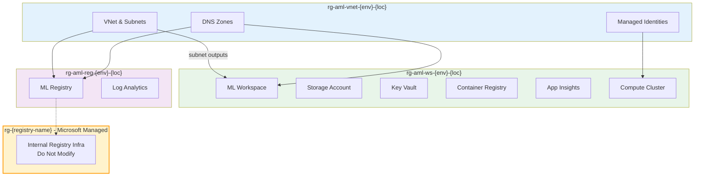

# Azure ML Operations (MLOps) Project

## Overview

This project demonstrates a **production-ready** Azure Machine Learning (ML) operations setup with Infrastructure as Code (IaC) using Terraform and comprehensive observability. The implementation follows Azure ML best practices with secure networking, managed identities, private endpoints, and enterprise-grade monitoring. **Successfully deployed and operational** with complete diagnostic settings coverage across all Azure services.

## 🏗️ Architecture

### Infrastructure Components


The infrastructure is deployed using **Terraform module orchestration** from the `infra` directory. The root orchestration coordinates three specialized modules with proper dependency management:


#### 1. **Networking Foundation** (`aml-vnet`)
- **Purpose**: Provides secure networking foundation for all ML services
- **Resources**: 
  - Virtual Network with private subnet (`10.1.0.0/16`)
  - 9 Private DNS zones for Azure ML and supporting services
  - VNet links for proper DNS resolution
  - User-assigned managed identities (compute cluster & online endpoint)
- **Resource Groups**: `rg-aml-vnet-{environment}-{location-code}`
- **Key Outputs**: VNet ID, subnet ID, DNS zone IDs, managed identity IDs

#### 2. **Azure ML Workspace** (`aml-managed-smi`)
- **Purpose**: Complete ML workspace with supporting services and security
- **Resources**:
  - ML workspace with managed VNet (approved outbound only)
  - Azure Storage Account with private endpoints
  - Azure Key Vault with private endpoints  
  - Azure Container Registry with private endpoints
  - Application Insights for monitoring
  - Compute cluster (`cpu-cluster-uami`) with user-assigned managed identity
  - Image build compute configuration for private ACR
  - Comprehensive RBAC configuration
- **Resource Groups**: `rg-aml-ws-{environment}-{location-code}`
- **Dependencies**: Uses `aml-vnet` outputs for networking and managed identities

#### 3. **Azure ML Registry** (`aml-registry-smi`)
- **Purpose**: Centralized model and component registry for sharing across workspaces
- **Resources**:
  - ML registry with private endpoint connectivity
  - Log Analytics workspace for monitoring
  - RBAC configuration for registry access
- **Model Registry**: `aml-reg-{environment}-{location-code}`
- **Resource Groups**: `rg-aml-reg-{environment}-{location-code}`
- **Dependencies**: Uses `aml-vnet` outputs for networking

### 🔄 **Module Dependencies & Orchestration**




**Dependency Flow:**
1. `aml-vnet` creates networking foundation and managed identities in its own resource group
2. `aml-managed-smi` uses VNet, DNS, and managed identity outputs for workspace and compute deployment in a separate resource group
3. `aml-registry-smi` uses VNet and DNS outputs for registry deployment in its own resource group
4. Azure automatically creates a Microsoft-managed resource group for internal registry infrastructure (do not modify)
5. All modules are orchestrated from the root `main.tf` for proper dependency management

### 🚀 **Deployment Options**

**Option 1: Orchestrated Deployment (Recommended)**
```bash
# Deploy all infrastructure with automatic dependency management from infra folder
cd infra
terraform init && terraform plan && terraform apply
```

**Option 2: Individual Module Deployment**
```bash
# Manual deployment in correct order (not recommended)
cd infra/aml-vnet && terraform apply
cd ../aml-managed-smi && terraform apply  
cd ../aml-registry-smi && terraform apply
```
   - Private endpoints for secure communication
   - Compute cluster with user-assigned managed identity

3. **Azure ML Registry** (`aml-registry-smi`)
   - ML registry for model sharing and versioning
   - Private endpoint connectivity

### 🔐 **Security Features**

- **Network Isolation**: 
  - Managed virtual network with `allow_only_approved_outbound` mode
  - No public IP addresses for compute instances/clusters
  - All traffic routed through private endpoints

- **Private Endpoints**: 
  - Azure Storage (blob, file, table, queue)
  - Azure Key Vault
  - Azure Container Registry  
  - Azure ML workspace
  - Azure ML registry

- **Managed Identities**: 
  - **Compute Cluster Identity**: User-assigned identity for compute clusters and compute instances
  - **Online Endpoint Identity**: User-assigned identity for managed online endpoints
  - **Workspace Identity**: System-assigned identity for workspace operations

- **RBAC Configuration**: 
  - Least privilege access with role-based permissions
  - User roles: Azure AI Developer, AzureML Compute Operator, AzureML Data Scientist
  - Managed identity roles: Storage access, Key Vault access, Registry access
  - **NEW**: Storage File Data Privileged Contributor for compute instances

- **IP Whitelisting**: Workspace access restricted to specified IP ranges

### 💻 **Compute Instance Support**

The infrastructure now fully supports compute instances with managed identities:

- **Managed Identity**: Can use the same user-assigned identity as compute clusters
- **Required Permissions**: 
  - ✅ Storage Blob Data Contributor (for training data)
  - ✅ Storage File Data Privileged Contributor (for notebooks/file shares)
  - ✅ Key Vault Secrets User (for accessing secrets)
  - ✅ AzureML Data Scientist (for workspace operations)

**Creating Compute Instances:**
```bash
# Using Azure CLI with managed identity
az ml compute create \
  --name my-compute-instance \
  --type ComputeInstance \
  --size STANDARD_DS3_v2 \
  --identity-type UserAssigned \
  --user-assigned-identities "/subscriptions/{subscription-id}/resourceGroups/{vnet-resource-group}/providers/Microsoft.ManagedIdentity/userAssignedIdentities/{cluster-identity-name}" \
  --resource-group {workspace-resource-group} \
  --workspace-name {workspace-name}
```

## 🚀 **Deployment Options**

> **✅ DEPLOYMENT STATUS**: Infrastructure successfully deployed and operational with comprehensive monitoring enabled. All diagnostic settings validated and production-ready.

### **Option 1: Orchestrated Deployment (Recommended)**
Deploy all infrastructure with automatic dependency management:

```bash
# Clone the repository
git clone https://github.com/jomedinagomez/MLOPs-AzureML.git
cd MLOPs-AzureML

# Navigate to infrastructure folder
cd infra

# Configure your settings
cp terraform.tfvars.example terraform.tfvars
# Edit terraform.tfvars with your specific values

# Deploy everything
terraform init
terraform plan
terraform apply
```

**Advantages:**
- ✅ Automatic dependency resolution
- ✅ Single command deployment
- ✅ Consistent state management
- ✅ Faster deployment with parallel resource creation

### **Option 2: Individual Module Deployment**
For debugging or specific requirements (not recommended for production):

```bash
# Deploy in correct dependency order
cd infra/aml-vnet && terraform init && terraform apply
cd ../aml-managed-smi && terraform init && terraform apply  
cd ../aml-registry-smi && terraform init && terraform apply
```

## 📋 **Prerequisites**

### Required Tools
- **Azure CLI** >= 2.75.0 with ML extension
- **Terraform** >= 1.0
- **Python** >= 3.8 with Azure ML SDK v2
- **Git** for repository management

### Azure Setup
- Azure subscription with appropriate permissions
- Contributor access to create resource groups and resources
- Rights to assign managed identity roles

### Installation Commands

```bash
# Install Azure CLI ML extension
az extension add --name ml

# Install Azure ML SDK v2
pip install --pre --upgrade azure-ai-ml azure-identity

# Verify installation
az version
terraform version
```

**Verified Tool Versions:**
```json
{
  "azure-cli": "2.75.0",
  "azure-cli-core": "2.75.0", 
  "azure-cli-telemetry": "1.1.0",
  "extensions": {
    "ml": "2.38.0"
  },
  "terraform": "1.5.x+"
}
```

## ⚙️ **Configuration**

### 1. **Update terraform.tfvars**

Configure the following key variables in `infra/terraform.tfvars`:

```hcl
# Environment Configuration
purpose                = "dev"                    # Environment: dev/test/prod
location               = "canadacentral"          # Azure region
location_code          = "cc"                     # Short region code
naming_suffix          = "01"                     # Deterministic suffix for naming

# Network Configuration  
vnet_address_space     = "10.1.0.0/16"           # VNet address range
subnet_address_prefix  = "10.1.1.0/24"           # ML subnet range

# Tags for resource management
tags = {
  environment   = "dev"
  project      = "ml-platform"
  owner        = "YourName"
  created_by   = "terraform"
  created_date = "2025-01-28"
}
```

### 2. **Resource Naming Convention**

The infrastructure follows a consistent naming pattern:

- **Resource Groups**: `rg-aml-{service}-{environment}-{location-code}`
  - `rg-aml-vnet-{environment}-{location-code}` (networking)
  - `rg-aml-ws-{environment}-{location-code}` (workspace)  
  - `rg-aml-reg-{environment}-{location-code}` (registry)

- **Resources**: `{environment}-{service}-{location-code}-{unique-id}`
  - `{environment}-aml-workspace-{location-code}-{unique-id}`
  - `{environment}-storage-{location-code}-{unique-id}`
  - `{environment}-kv-{location-code}-{unique-id}`

### 3. **Network Planning**

Ensure your network ranges don't conflict with existing infrastructure:

- **VNet**: `10.1.0.0/16` (65,534 IPs)
- **ML Subnet**: `10.1.1.0/24` (254 IPs)
- **Private Endpoints**: Automatically assigned within subnet

## 📊 **Infrastructure Overview**

### **Deployed Resources**

| Service Category | Resource Type | Resource Group | Purpose |
|-----------------|---------------|----------------|---------|
| **Networking** | Virtual Network | `rg-aml-vnet-{environment}-{location-code}` | Network foundation |
| | Private DNS Zones (9) | `rg-aml-vnet-{environment}-{location-code}` | DNS resolution |
| | Managed Identities (2) | `rg-aml-vnet-{environment}-{location-code}` | Security identities |
| **ML Platform** | ML Workspace | `rg-aml-ws-{environment}-{location-code}` | Core ML platform |
| | Storage Account | `rg-aml-ws-{environment}-{location-code}` | Data storage |
| | Key Vault | `rg-aml-ws-{environment}-{location-code}` | Secrets management |
| | Container Registry | `rg-aml-ws-{environment}-{location-code}` | Container images |
| | Application Insights | `rg-aml-ws-{environment}-{location-code}` | Monitoring |
| | Compute Cluster | `rg-aml-ws-{environment}-{location-code}` | ML compute |
| **Registry** | ML Registry | `rg-aml-reg-{environment}-{location-code}` | Model registry |
| | Log Analytics | `rg-aml-reg-{environment}-{location-code}` | Registry monitoring |

### **Resource Group Organization**

Each service category is deployed into its own dedicated resource group for better management and access control:

- **`rg-aml-vnet-{environment}-{location-code}`**: Contains networking infrastructure (VNet, DNS zones, managed identities)
- **`rg-aml-ws-{environment}-{location-code}`**: Contains ML workspace and supporting services (storage, Key Vault, container registry, monitoring)
- **`rg-aml-reg-{environment}-{location-code}`**: Contains ML registry and its monitoring components

### **Microsoft Managed Resource Groups**

**Important**: The Azure ML Registry automatically creates a **Microsoft managed resource group** that you will see in your subscription:

- **Name Pattern**: `rg-{registry-name}` (automatically generated by Azure)
- **Purpose**: Contains internal Azure ML Registry infrastructure components
- **Management**: Fully managed by Microsoft - do not modify or delete
- **Visibility**: Appears in your subscription but is not directly manageable
- **Lifecycle**: Automatically created when registry is deployed, removed when registry is deleted

> ⚠️ **Note**: Do not attempt to manage or modify resources in the Microsoft managed resource group as this can break the ML Registry functionality.

### **Cost Optimization**

- **Compute clusters**: Auto-scale from 0 to 4 nodes
- **Storage**: Standard tier with lifecycle management
- **Key Vault**: Standard tier
- **Private endpoints**: Shared across services where possible

## 🔑 **Role-Based Access Control (RBAC)**

### **User Account Permissions**
Assigned to your Azure AD user account for workspace access:

| Role | Scope | Purpose |
|------|-------|---------|
| `Azure AI Developer` | Workspace | Full ML development capabilities |
| `AzureML Compute Operator` | Workspace | Create/manage compute resources |
| `AzureML Data Scientist` | Workspace | Run experiments and access data |
| `Storage Blob Data Contributor` | Storage Account | Access training data and artifacts |
| `Storage File Data Privileged Contributor` | Storage Account | Access notebooks and file shares |

### **Managed Identity Permissions**
Assigned to compute cluster/instance managed identity (`{managed-identity-name}`):

| Role | Scope | Purpose |
|------|-------|---------|
| `AzureML Data Scientist` | Workspace | Execute ML workloads |
| `Storage Blob Data Contributor` | Storage Account | Read/write training data |
| `Storage File Data Privileged Contributor` | Storage Account | **NEW**: Access file shares for compute instances |
| `Key Vault Secrets User` | Key Vault | Access secrets during training |
| `AzureML Registry User` | Registry | Access registered models/components |

### **Workspace System Identity Permissions**
Assigned to workspace system-managed identity for infrastructure operations:

| Role | Scope | Purpose |
|------|-------|---------|
| `Reader` | Resource Group | Read resource metadata |
| `Azure AI Enterprise Network Connection Approver` | Resource Group | Approve private endpoint connections |

## 🖥️ **Compute Resources**

### **Compute Cluster Configuration**
- **Name**: `cpu-cluster-uami`
- **VM Size**: Standard_F8s_v2 (8 vCPUs, 16 GB RAM)
- **Scaling**: 2 to 4 nodes (auto-scale)
- **Identity**: User-assigned managed identity
- **Network**: Private subnet, no public IP
- **Purpose**: ML training workloads and Docker image builds

### **Image Build Configuration**
Since the Azure Container Registry is behind a private endpoint, the workspace is configured to use the compute cluster for Docker image builds:

- **Build Compute**: `cpu-cluster-uami`
- **Purpose**: Builds custom Docker images when ACR is private
- **Requirement**: Necessary for environment creation and custom images
- **Configuration**: Automatically configured via Terraform

### **Compute Instance Support**
The infrastructure supports compute instances with managed identity:

```yaml
# Example compute instance configuration
name: my-compute-instance
type: computeinstance
size: STANDARD_DS3_v2
identity:
  type: user_assigned
  user_assigned_identities:
    - resource_id: "/subscriptions/{subscription}/resourceGroups/{resource-group-name}/providers/Microsoft.ManagedIdentity/userAssignedIdentities/{managed-identity-name}"
```

**Key Benefits:**
- ✅ Unified identity management (same identity for clusters and instances)
- ✅ Notebook support with file share access
- ✅ Private networking with no public IP
- ✅ Automatic authentication to workspace services

### Pipeline Overview

The project includes a comprehensive ML pipeline (`taxi-fare-train-pipeline.yaml`) that demonstrates end-to-end machine learning operations:

```
Data Merge → Transform → Train → Predict → Compare/Score → Register → Deploy
```

### Pipeline Components

1. **Merge Job** (`merge_job`)
   - Combines green and yellow taxi datasets
   - Input: Raw CSV files
   - Output: Merged dataset

2. **Transform Job** (`transform_job`)
   - Data preprocessing and feature engineering
   - Train/test split (70/30)
   - Output: Training and testing datasets

3. **Train Job** (`train_job`)
   - Model training using sklearn
   - MLflow integration for experiment tracking
   - Output: Trained model artifacts

4. **Predict Job** (`predict_job`)
   - Generate predictions on test data
   - Input: Trained model and test dataset
   - Output: Prediction results

5. **Compare Job** (`compare_job`)
   - Model performance evaluation
   - Comparison with baseline models
   - Output: Performance metrics

6. **Score Job** (`score_job`)
   - Model scoring and evaluation
   - Generate performance reports
   - Output: Scoring results

7. **Register Job** (`register_job`)
   - Model registration in Azure ML
   - Version management
   - Output: Registered model reference

8. **Deploy Job** (`deploy_job`)
   - Model deployment to managed endpoint
   - Real-time inference setup
   - Output: Deployed endpoint

### Running the Pipeline

#### Method 1: Azure CLI

```bash
az ml job create \
  --file pipelines/taxi-fare-train-pipeline.yaml \
  --workspace-name <workspace-name> \
  --resource-group <resource-group> \
  --subscription <subscription-id>
```

#### Method 2: Python SDK

```bash
python submit_pipeline.py
```

### Pipeline Configuration

- **Compute**: Managed compute cluster (Standard_DS3_v2, 2 nodes)
- **Environment**: `AzureML-sklearn-1.0-ubuntu20.04-py38-cpu@latest`
- **Experiment**: `nyc-taxi-pipeline-class`
- **Default Datastore**: `workspaceblobstore`

## Project Structure

```
MLOPs-AzureML/
├── infra/                          # Terraform Infrastructure
│   ├── aml-vnet/                   # Network foundation
│   ├── aml-managed-smi/            # ML workspace
│   ├── aml-registry-smi/           # ML registry
│   └── modules/                    # Reusable Terraform modules
├── src/                            # ML Pipeline Components
│   ├── merge_data/                 # Data merging logic
│   ├── transform/                  # Data transformation
│   ├── train/                      # Model training
│   ├── predict/                    # Prediction generation
│   ├── compare/                    # Model comparison
│   ├── score/                      # Model scoring
│   ├── register/                   # Model registration
│   ├── deploy/                     # Model deployment
│   └── components/                 # Component definitions
├── pipelines/                      # Pipeline definitions
│   └── taxi-fare-train-pipeline.yaml
├── data/                          # Training data
│   └── taxi-data/
└── notebooks/                     # Jupyter notebooks
```

## Key Features

### Infrastructure as Code
- **Modular Design**: Reusable Terraform modules
- **Environment Separation**: Support for dev/staging/prod
- **State Management**: Remote state storage capability
- **Dependency Management**: Proper resource dependencies

### Security Best Practices
- **Network Isolation**: Private networking throughout
- **Identity Management**: Managed identities for all resources
- **Access Control**: RBAC with least privilege
- **Encryption**: Data encryption at rest and in transit

### MLOps Capabilities
- **Experiment Tracking**: MLflow integration
- **Model Versioning**: Automated model registration
- **Pipeline Orchestration**: Component-based pipeline design
- **Automated Deployment**: Model-to-endpoint deployment
- **Monitoring**: Built-in logging and monitoring

## Monitoring and Observability

### Comprehensive Diagnostic Settings (Production-Deployed)
- **✅ Azure ML Workspace**: 12 supported log categories for complete ML operations monitoring
  - Compute events, job tracking, model management, dataset operations, environment changes
- **✅ Azure ML Registry**: 2 asset tracking categories for model and component lifecycle monitoring  
- **✅ Virtual Network**: Security monitoring with VM protection alerts
- **✅ Log Analytics Workspace**: Centralized log collection and analysis across all services

### Application Insights
- Real-time monitoring of ML workspace
- Custom telemetry and logging
- Performance tracking
- Integrated with diagnostic settings for complete observability

### Azure Monitor
- Infrastructure monitoring with validated diagnostic categories
- Resource health tracking
- Alerting and notifications
- Private endpoint connectivity for secure monitoring traffic

### MLflow Tracking
- Experiment tracking and comparison
- Model metrics and parameters
- Artifact management

## Troubleshooting

### Common Issues

1. **Key Vault Soft-Delete Conflicts**
   - **Issue**: `409 Conflict` errors during deployment due to existing Key Vault names in soft-delete state
   - **Cause**: Previous deployments may have left Key Vaults in soft-delete state (90-day retention)
   - **Solutions**: 
     
     **Option A - Auto-Purge (Dev/Test)**: Enable automatic purging in `terraform.tfvars`:
     ```hcl
     enable_auto_purge = true  # NEVER use in production!
     ```
     
     **Option B - Manual Purge**: 
     ```bash
     # List soft-deleted Key Vaults
     az keyvault list-deleted --query "[].{Name:name, Location:properties.location, DeletionDate:properties.deletionDate}" --output table
     
     # Purge specific Key Vault (replace with actual name and location)
     az keyvault purge --name kvdevcc002 --location canadacentral
     ```
     
     **Option C - Cleanup Script**: Use the provided PowerShell script:
     ```powershell
     .\infra\cleanup.ps1  # Interactive cleanup with Key Vault purging
     ```
   - **Prevention**: Always purge Key Vaults when cleaning up test environments

2. **Authorization Failures**
   - Verify RBAC role assignments
   - Check managed identity permissions
   - Ensure IP whitelisting is configured

3. **Network Connectivity**
   - Validate private endpoint connections
   - Check DNS resolution
   - Verify firewall rules

4. **Pipeline Failures**
   - Check compute cluster status
   - Validate input data paths
   - Review component logs in Azure ML Studio

### Useful Commands

```bash
# Set default configuration
az account set --subscription <subscription>
az configure --defaults workspace=<workspace-name> group=<resource-group> location=<location>

# Check compute cluster status
az ml compute list --workspace-name <workspace-name> --resource-group <resource-group>

# Monitor pipeline run
az ml job show --name <job-name> --workspace-name <workspace-name> --resource-group <resource-group>

# List registered models
az ml model list --workspace-name <workspace-name> --resource-group <resource-group>

# Check role assignments
az role assignment list --scope <resource-scope>
```

## Cost Optimization

- **Compute Auto-scaling**: Cluster scales to zero when idle
- **Reserved Instances**: Consider for production workloads
- **Storage Tiers**: Use appropriate storage tiers for data
- **Resource Tagging**: Implemented for cost tracking

## Next Steps

- [ ] Implement automated testing
- [ ] Add CI/CD pipeline with GitHub Actions
- [ ] Configure model monitoring and drift detection
- [ ] Implement A/B testing for model deployments
- [ ] Add data quality checks
- [ ] Implement automated retraining

---


## Change Log

This section documents changes and updates to the project.

### Version 1.4.0 (Latest)
- Diagnostic settings infrastructure deployed with monitoring enabled and validated for all supported Azure services
- Updated all diagnostic settings to use only Microsoft-supported log categories and the `enabled_metric` syntax, removing deprecation warnings and deployment failures
- Monitoring covers Azure ML Workspace (12 log categories), ML Registry (2 asset tracking categories), Virtual Network (VM protection alerts), Container Registry, Storage, Key Vault, and Application Insights (11 log categories)
- Removed unsupported or duplicate diagnostic settings and upgraded AzureRM provider for compatibility
- Adjusted ML Registry diagnostics to exclude unsupported metrics and focus on asset tracking logs
- Platform is operational with centralized Log Analytics and validated monitoring for all major resource types

### Version 1.3.0
- Centralized Log Analytics workspace with diagnostic settings for all major resource types
- Consolidated diagnostic settings and removed duplicate Log Analytics workspaces
- Configured private endpoint connectivity for Azure Monitor traffic and diagnostic logging
- Updated trusted services bypass for Storage Account to allow Azure Monitor diagnostic settings service access
- Added diagnostic settings for Azure ML workspace (24 categories), Application Insights (11 categories), Key Vault, Storage Account, Container Registry, and VNet
- Reviewed all resources to ensure diagnostic settings coverage
- Verified diagnostic log connectivity through private endpoint architecture

### Version 1.2.0
- Added support for Azure ML compute instances
- Implemented Storage File Data Privileged Contributor role for managed identities
- Enabled compute instances to access workspace file shares via managed identity
- Sanitized real variable names from documentation for security compliance
- Enhanced Mermaid diagrams showing infrastructure relationships
- Added detailed debugging sections across documentation

### Version 1.1.0
- Implemented root-level module orchestration
- Refactored to use module outputs as inputs for dependency management
- Moved all root Terraform files to `infra/` folder
- Added outputs.tf files to all modules
- Implemented conditional DNS zone logic with fallback support
- Updated private endpoints to use module outputs
- Added input validation for GUIDs, CIDR blocks, and naming conventions
- Created infra/README.md with deployment guidance
- Removed duplicate files and consolidated configuration

### Version 1.0.0
- Deployed Azure ML platform with private networking
- Implemented aml-vnet, aml-managed-smi, and aml-registry-smi modules
- Configured managed identities, private endpoints, and RBAC
- Managed VNet with approved outbound-only configuration
- Built 8-step taxi fare prediction pipeline with MLflow integration
- Deployed auto-scaling compute cluster with user-assigned managed identity
- Established centralized model and component registry

---

## 📝 **Project Status & Roadmap**

### **✅ Completed Features**
- ✅ **Complete Infrastructure**: Azure ML platform with private networking and managed identities
- ✅ **Dual Compute Support**: Both compute clusters and compute instances with unified identity management
- ✅ **Secure Networking**: Private VNet with managed endpoints and DNS zones
- ✅ **Registry Integration**: Centralized model and component sharing
- ✅ **RBAC Configuration**: Comprehensive role assignments for users and services
- ✅ **Documentation**: Security-hardened README files and deployment guides
- ✅ **ML Pipeline**: 8-step taxi fare prediction pipeline with MLflow integration
- ✅ **Production-Ready Observability**: Successfully deployed comprehensive diagnostic settings for all Azure services
- ✅ **Enterprise Monitoring**: Centralized Log Analytics workspace with validated, supported log categories
- ✅ **Network Security**: Private endpoints with complete network isolation and Azure Monitor traffic support
- ✅ **Modern Terraform Syntax**: Updated to latest AzureRM provider with future-proof diagnostic configurations

### **🔄 Current Capabilities**
- **Infrastructure**: Complete Azure ML platform with private networking and private endpoint security
- **Security**: Identity-based authentication with managed identities and network access controls
- **Compute**: Support for both compute clusters and compute instances
- **Development**: Jupyter notebook support with file share access
- **Model Management**: Registry-based model sharing and versioning
- **Monitoring**: Production-deployed comprehensive diagnostic settings covering ML workspace, registry, VNet, and all supporting services
- **Observability**: Enterprise-grade logging with validated Microsoft-supported categories for all 12+ resource types
- **Deployment Ready**: Fully functional MLOps platform ready for production workloads

### **🚀 Future Enhancements**
- [ ] **CI/CD Pipeline**: GitHub Actions for automated deployment
- [ ] **Multi-Environment**: Production-ready environment promotion
- [ ] **Custom Dashboards**: Azure Monitor workbooks and alerting rules
- [ ] **Data Governance**: Data lineage and compliance features
- [ ] **MLOps Integration**: Advanced ML lifecycle management

## 🤝 **Contributing**

We welcome contributions to improve this MLOps implementation:

### **How to Contribute**
1. **Fork the repository**
2. **Create a feature branch**: `git checkout -b feature/your-feature-name`
3. **Follow coding standards**: Use consistent Terraform formatting
4. **Update documentation**: Ensure README files reflect your changes
5. **Test thoroughly**: Validate infrastructure changes in a dev environment
6. **Submit a pull request**: Provide clear description of changes

### **Contribution Guidelines**
- **Infrastructure as Code**: All Azure resources must be defined in Terraform
- **Security First**: Follow Azure security best practices
- **Documentation**: Update relevant README files for any changes
- **Testing**: Ensure changes don't break existing functionality
- **Naming Conventions**: Follow established resource naming patterns

## 🆘 **Support & Resources**

### **Getting Help**
- **📖 Documentation**: Review the comprehensive README files in each module
- **🔧 Troubleshooting**: Check the troubleshooting section in `/infra/README.md`
- **💬 Issues**: Open a GitHub issue for bugs or feature requests
- **📧 Contact**: Reach out to the project maintainers

### **Additional Resources**
- **[Azure ML Documentation](https://docs.microsoft.com/azure/machine-learning/)**
- **[Terraform Azure Provider](https://registry.terraform.io/providers/hashicorp/azurerm/latest)**
- **[Azure Private Link](https://docs.microsoft.com/azure/private-link/)**
- **[Azure RBAC](https://docs.microsoft.com/azure/role-based-access-control/)**

### **Community**
- **Repository**: [GitHub - MLOPs-AzureML](https://github.com/jomedinagomez/MLOPs-AzureML)
- **Issues & Discussions**: Use GitHub issues for questions and feature requests
- **Best Practices**: Follow Azure Well-Architected Framework principles

---

**📋 Project Information**
- **Authors**: Jose Medina Gomez & Matt Felton
- **Last Updated**: July 29, 2025
- **Version**: 1.4.0
- **License**: MIT License
- **Repository**: [github.com/jomedinagomez/MLOPs-AzureML](https://github.com/jomedinagomez/MLOPs-AzureML)

**🏷️ Tags**: `azure-ml` `terraform` `infrastructure-as-code` `private-networking` `managed-identity` `mlops` `machine-learning` `azure-private-endpoints`