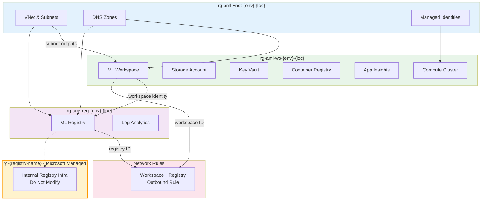

# Azure ML Platform Deployment Guide

## Overview

This Azure ML platform follows the deployment strategy with **complete environment isolation** and uses a **single service principal** approach for infrastructure automation across all environments.

## Deployment Architecture

### Service Principal Strategy (Updated)

The service principal is created **independently** before any environment deployment and has permissions across **all 6 resource groups** (3 dev + 3 prod) as per the deployment strategy:

```
Service Principal: sp-aml-deployment-platform
├── Scope: All 6 resource groups across both environments
├── Permissions per resource group:
│   ├── Contributor: Deploy ML infrastructure
│   ├── User Access Administrator: Configure RBAC  
│   └── Network Contributor: Configure networking
└── Created: Before any environment deployment
```

## Deployment Order

### Phase 1: Service Principal Creation (First)

1. **Create Service Principal** (independent step):
   ```bash
   cd infra/service-principal
   terraform init
   terraform plan
   terraform apply
   ```

   **Outputs**: Service Principal credentials for CI/CD pipeline configuration

### Phase 2: Environment Deployment

2. **Deploy Development Environment**:
   ```bash
   cd infra
   terraform init
   terraform plan -var-file="environments/dev.tfvars"
   terraform apply -var-file="environments/dev.tfvars"
   ```

3. **Deploy Production Environment**:
   ```bash
   cd infra  
   terraform plan -var-file="terraform.tfvars.prod"
   terraform apply -var-file="terraform.tfvars.prod"
   ```

## Key Benefits

**Service Principal Pre-Authorization**: SP has permissions across all resource groups before deployment  
**No Chicken-and-Egg**: No dependency between SP creation and resource group existence  
**Deployment Strategy Compliance**: Single SP manages all 6 resource groups as specified  
**CI/CD Ready**: SP credentials available immediately for pipeline configuration  
**Environment Agnostic**: Same SP works for both dev and prod deployments  

This approach aligns perfectly with the deployment strategy requirement for a single service principal managing all 6 resource groups across both environments.
1. **aml-vnet**: Deploys networking, DNS, and managed identities (foundation for all other modules)
2. **aml-managed-smi**: Deploys ML workspace, storage, Key Vault, ACR, compute, and private endpoints. Consumes outputs from `aml-vnet`.
3. **aml-registry-smi**: Deploys ML registry, Log Analytics, and private endpoint. Consumes outputs from `aml-vnet` and workspace identity from `aml-managed-smi`.
4. **workspace-to-registry-outbound-rule**: Creates user-defined outbound rule allowing workspace to create managed private endpoints to the registry.
5. **workspace-storage-network-rules**: Configures storage account network access rules to enable asset sharing between workspace and registry.

### Orchestration & Dependency Diagram


### Microsoft-Managed Resource Groups
> **Important:** When deploying the ML Registry, Azure automatically creates a Microsoft-managed resource group (`rg-{registry-name}`) containing internal infrastructure (storage, ACR, etc.). **Never modify or delete resources in this group.**

### Key Dependency Callouts
- **aml-managed-smi** and **aml-registry-smi** both require outputs from **aml-vnet** (subnet, DNS, managed identities)
- **aml-registry-smi** requires the workspace principal ID from **aml-managed-smi** for network connection approver permissions
- **workspace-to-registry-outbound-rule** requires both workspace ID and registry ID, enabling managed private endpoint creation from workspace to external registry
- All modules are orchestrated from the root `main.tf` for dependency management
- Microsoft-managed resource groups are created automatically for the registry and are not managed by Terraform

**Note:** Always deploy modules in the order above. Confirm outputs from `aml-vnet` before proceeding with dependent modules. All dependencies are managed via module outputs and remote state.

**Key Dependencies:**
1. **aml-vnet** creates networking foundation and managed identities
2. **aml-managed-smi** consumes VNet outputs and managed identity references  
3. **aml-registry-smi** consumes VNet outputs for private connectivity AND workspace identity for network connection approver role
4. All modules coordinate through root orchestration
│   └── terraform.tfvars          # Registry configuration
└── modules/                       # Reusable Terraform modules
    ├── storage-account/           # Storage account module
    ├── key-vault/                 # Key Vault module
    ├── container-registry/        # Container Registry module
    └── private-endpoint/          # Private endpoint module
```

## 🚀 Quick Start

### Prerequisites

- **Azure CLI**: Version 2.75.0+ with ML extension
- **Terraform**: Version 1.0+
- **Azure Subscription**: With appropriate permissions
- **PowerShell**: For Windows users

```bash
# Install Azure ML extension
az extension add --name ml

# Verify installations
az --version
terraform --version
```

### 1. Configure Variables

Edit `terraform.tfvars` with your specific values:

```hcl
# Purpose and Environment
purpose       = "dev"                    # Change to your environment
location      = "canadacentral"          # Change to your preferred region
location_code = "cc"                     # Update accordingly
random_string = "001"                    # Your unique identifier

# Azure Subscription (REQUIRED)
sub_id = "your-subscription-id-here"     # Replace with actual subscription ID

# User Management (REQUIRED)
user_object_id = "your-user-object-id"   # Replace with your user object ID

# Networking Configuration (Optional)
vnet_address_space    = "10.1.0.0/16"
subnet_address_prefix = "10.1.1.0/24"

# Resource Tagging (Optional)
tags = {
  environment = "dev"
  project     = "ml-platform"
  created_by  = "terraform"
  owner       = "ml-team"
}
```

### 2. Deploy Infrastructure

```bash
# Navigate to infra folder
cd infra

# Initialize Terraform
terraform init

# Review planned changes
terraform plan

# Deploy infrastructure
terraform apply
```

### 3. Verify Deployment

```bash
# Check outputs
terraform output

# Verify in Azure portal or CLI
az ml workspace list --subscription <subscription-id>
```

## 🏗️ Architecture Overview

### Module Dependencies

```
Root Orchestration (main.tf)
├── 1. aml-vnet (networking foundation)
│   ├── Virtual Network (10.1.0.0/16)
│   ├── Private Subnet (10.1.1.0/24)
│   ├── 9 Private DNS Zones
│   └── 2 Managed Identities
│
├── 2. aml-workspace (depends on aml-vnet)
│   ├── Azure ML Workspace
│   ├── Storage Account + Private Endpoint
│   ├── Key Vault + Private Endpoint
│   ├── Container Registry + Private Endpoint
│   ├── Application Insights
│   ├── Compute Cluster
│   └── Role Assignments
│
└── 3. aml-registry (depends on aml-vnet + aml-workspace)
    ├── Azure ML Registry
    ├── Log Analytics Workspace
    ├── Private Endpoint
    └── Cross-workspace permissions for network connection approver role

└── 4. workspace-to-registry-outbound-rule (depends on aml-workspace + aml-registry)
    └── User-defined outbound rule enabling workspace managed private endpoint creation to external registry (named: allow-external-registry-{purpose})
```

### Resource Count

| Module | Resource Types | Approximate Count | Resource Group |
|--------|---------------|-------------------|----------------|
| **aml-vnet** | VNet, Subnet, DNS Zones, Identities | ~12 resources | `rg-aml-vnet-{environment}-{location-code}` |
| **aml-workspace** | Workspace, Storage, KV, ACR, AI, Compute, PE | ~25 resources | `rg-aml-ws-{environment}-{location-code}` |
| **aml-registry** | Registry, Log Analytics, PE | ~5 resources | `rg-aml-reg-{environment}-{location-code}` |
| **outbound-rule** | Workspace network outbound rule | ~1 resource | Managed by workspace |
| **Microsoft Managed** | ML Registry Internal Components | ~3-5 resources | `rg-{registry-name}` (auto-created) |
| **Total** | | **~46 resources** | **4 resource groups** |

### **Microsoft Managed Resource Groups**

**Important**: The Azure ML Registry automatically creates additional infrastructure:


- **Visibility**: Appears in your subscription but is not directly manageable through Terraform
- **Lifecycle**: Automatically created when registry is deployed, removed when registry is deleted

> **Critical Warning**: Do not attempt to manage, modify, or delete resources in the Microsoft managed resource group as this will break the ML Registry functionality and may require Microsoft support to resolve.

## Configuration

### Required Variables

| Variable | Description | Example |
|----------|-------------|---------|
| `sub_id` | Azure subscription ID | `"12345678-1234-1234-1234-123456789012"` |
| `user_object_id` | User's Azure AD object ID | `"87654321-4321-4321-4321-210987654321"` |

### Optional Variables

| Variable | Default | Description |
|----------|---------|-------------|
| `purpose` | `"dev"` | Environment identifier |
| `location` | `"canadacentral"` | Azure region |
| `location_code` | `"cc"` | Short region code |
| `random_string` | `"001"` | Unique identifier |
| `vnet_address_space` | `"10.1.0.0/16"` | VNet CIDR block |
| `subnet_address_prefix` | `"10.1.1.0/24"` | Subnet CIDR block |

## 📤 Outputs

The infrastructure provides comprehensive outputs for integration:

### Networking Outputs
- `vnet_id`: Virtual Network ID
- `subnet_id`: Private subnet ID
- `dns_zone_ids`: Map of all DNS zone IDs
- `resource_group_name_dns`: DNS resource group name

### ML Workspace Outputs
- `workspace_id` & `workspace_name`: ML workspace details
- `storage_account_name` & `storage_account_id`: Storage details
- `keyvault_name` & `keyvault_id`: Key Vault details
- `container_registry_name` & `container_registry_id`: ACR details
- `managed_identity_id` & `managed_identity_principal_id`: Identity details

### ML Registry Outputs
- `registry_id` & `registry_name`: Registry details
- `registry_storage_account_name`: Registry storage
- `registry_keyvault_name`: Registry Key Vault

### Summary Output
- `deployment_summary`: High-level deployment overview

## 🔐 Security Features

### Network Security
- **Private Networking**: All resources use private endpoints
- **DNS Resolution**: Custom DNS zones for service resolution
- **Network Isolation**: Managed VNet with approved outbound only

### Identity & Access
- **Managed Identities**: User-assigned identities for compute
- **RBAC**: Least privilege role assignments
- **Cross-Service Permissions**: Workspace has network connection approver role on registry
- **Key Management**: Azure Key Vault for secrets

### Network Connectivity
- **User-Defined Outbound Rules**: Workspace can create managed private endpoints to external registry
- **Managed Virtual Network**: AllowOnlyApprovedOutbound isolation mode with Azure Firewall Standard SKU
- **Cross-Registry Connectivity**: Automated outbound rule creation for workspace→registry communication

### Asset Sharing Configuration
This infrastructure automatically configures asset sharing between the secure workspace and the ML registry created in the same deployment, implementing the [Microsoft documentation requirements](https://learn.microsoft.com/en-us/azure/machine-learning/how-to-registry-network-isolation?view=azureml-api-2&tabs=existing#share-assets-from-workspace-to-registry).

#### Automatic Configuration
The Terraform deployment automatically configures:
- **Workspace Storage Account Network Rules**: Enables "from selected virtual networks and IP addresses"
- **Resource Instance Access**: Adds the created ML registry as an authorized resource
- **Registry-Specific Permissions**: Grants the registry access to the workspace storage account

#### What Gets Configured
- **Storage Account Public Access**: Set to "Enabled from selected virtual networks and IP addresses"
- **Resource Access Rules**: Configured for both workspace and registry access using the registry ID from module outputs
- **Network Security**: Maintains security while enabling required connectivity for asset sharing

#### Validation
After deployment, verify in Azure Portal:
1. Navigate to workspace storage account → Networking
2. Confirm "Selected networks" is enabled
3. Check "Resource instances" section shows the ML registry resource

#### Detailed Verification Steps

##### 1. Storage Account Network Configuration
```bash
# Get storage account name from Terraform outputs
STORAGE_ACCOUNT=$(terraform output -raw workspace_storage_account_name)
WORKSPACE_RG=$(terraform output -raw workspace_resource_group_name)

# Check storage account network rules via Azure CLI
az storage account show \
  --name $STORAGE_ACCOUNT \
  --resource-group $WORKSPACE_RG \
  --query "networkRuleSet.{defaultAction:defaultAction,bypass:bypass,resourceAccessRules:resourceAccessRules}" \
  --output table
```

##### 2. Azure Portal Verification
1. **Navigate to Storage Account**:
   - Go to Azure Portal → Resource Groups → `rg-aml-ws-{env}-{loc}`
   - Click on the storage account (format: `st{purpose}{locationcode}{random}`)

2. **Check Networking Settings**:
   - Go to **Security + networking** → **Networking**
   - Verify **Public network access** = "Enabled from selected virtual networks and IP addresses"
   - Scroll to **Resource instances** section
   - Confirm you see an entry for `Microsoft.MachineLearningServices/registries` with your registry name

3. **Verify Registry Access**:
   - The registry entry should show:
     - **Resource type**: `Microsoft.MachineLearningServices/registries`
     - **Instance name**: `amlr{purpose}{locationcode}{random}`
     - **Tenant ID**: `*` (wildcard)

##### 3. Test Asset Sharing Functionality
```bash
# Get workspace and registry names
WORKSPACE_NAME=$(terraform output -raw workspace_name)
REGISTRY_NAME=$(terraform output -raw registry_name)

# Test connectivity from workspace to registry
az ml job create \
  --workspace-name $WORKSPACE_NAME \
  --resource-group $WORKSPACE_RG \
  --file test-job.yaml

# Check if workspace can access registry assets
az ml model list \
  --workspace-name $WORKSPACE_NAME \
  --resource-group $WORKSPACE_RG \
  --registry-name $REGISTRY_NAME
```

##### 4. Network Connectivity Verification
```bash
# Check outbound rules are configured
az ml workspace outbound-rule list \
  --workspace-name $WORKSPACE_NAME \
  --resource-group $WORKSPACE_RG \
  --output table

# Verify the specific outbound rule exists
az ml workspace outbound-rule show \
  --workspace-name $WORKSPACE_NAME \
  --resource-group $WORKSPACE_RG \
  --rule-name "allow-external-registry-${PURPOSE}"
```

##### 5. End-to-End Asset Sharing Test
Create a test script to verify asset sharing works:

```python
# test_asset_sharing.py
from azure.ai.ml import MLClient
from azure.identity import DefaultAzureCredential

# Initialize clients
credential = DefaultAzureCredential()
workspace_client = MLClient(
    credential=credential,
    subscription_id="your-subscription-id",
    resource_group_name="rg-aml-ws-{env}-{loc}",
    workspace_name="amlws{purpose}{locationcode}{random}"
)

registry_client = MLClient(
    credential=credential,
    subscription_id="your-subscription-id",
    registry_name="amlr{purpose}{locationcode}{random}"
)

try:
    # Test: List models from registry via workspace
    print("Testing registry access from workspace...")
    models = registry_client.models.list()
    print(f"✓ Successfully accessed registry. Found {len(list(models))} models")
    
    # Test: Create a simple model in workspace
    print("Testing model creation in workspace...")
    from azure.ai.ml.entities import Model
    from azure.ai.ml.constants import AssetTypes
    
    test_model = Model(
        name="test-connectivity-model",
        version="1",
        description="Test model for connectivity verification",
        type=AssetTypes.CUSTOM_MODEL,
        path="./test_model"  # You'd need a simple model file
    )
    
    workspace_client.models.create_or_update(test_model)
    print("✓ Successfully created model in workspace")
    
    print("🎉 Asset sharing configuration verified successfully!")
    
except Exception as e:
    print(f"Asset sharing test failed: {str(e)}")
    print("Check network configuration and permissions")
```

##### 6. Troubleshooting Failed Verification

If verification fails, check these common issues:

```bash
# 1. Check if Terraform applied all resources successfully
terraform plan -detailed-exitcode
# Exit code 0 = no changes needed, 2 = changes pending

# 2. Verify outbound rule exists
az rest --method GET \
  --url "https://management.azure.com/subscriptions/$(az account show --query id -o tsv)/resourceGroups/$WORKSPACE_RG/providers/Microsoft.MachineLearningServices/workspaces/$WORKSPACE_NAME/outboundRules?api-version=2024-04-01"

# 3. Check storage account network rules directly
az rest --method GET \
  --url "https://management.azure.com/subscriptions/$(az account show --query id -o tsv)/resourceGroups/$WORKSPACE_RG/providers/Microsoft.Storage/storageAccounts/$STORAGE_ACCOUNT?api-version=2023-05-01" \
  --query "properties.networkAcls"

# 4. Verify registry permissions
REGISTRY_RG=$(terraform output -raw registry_resource_group_name)
az ml registry show \
  --name $REGISTRY_NAME \
  --resource-group $REGISTRY_RG
```

##### 7. Expected Success Indicators
**Storage Account**: Shows "Selected networks" with registry in resource instances  
**Outbound Rule**: `allow-external-registry-{purpose}` rule exists and shows "Approved" status  
**Registry Access**: Workspace can query registry models/environments without errors  
**Network Connectivity**: No timeout errors when accessing registry from workspace  
**Asset Operations**: Can successfully share/copy assets between workspace and registry

### Data Protection
- **Encryption**: Data encrypted at rest and in transit
- **Private Endpoints**: No public internet exposure
- **Access Controls**: IP restrictions and firewall rules

## 🧪 Testing & Validation

### Pre-deployment Checks
```bash
# Validate Terraform configuration
terraform validate

# Format Terraform files
terraform fmt -recursive

# Security scan (if tfsec installed)
tfsec .
```

### Post-deployment Validation
```bash
# Test workspace connectivity
az ml workspace show --name <workspace-name> --resource-group <rg-name>

# Verify private endpoints
az network private-endpoint list --resource-group <rg-name>

# Check role assignments
az role assignment list --scope <resource-scope>
```

## 🔄 Module Outputs as Inputs

The orchestration leverages module outputs for dependencies:

```hcl
# Example: Workspace module uses VNet outputs
module "aml_workspace" {
  source = "./aml-managed-smi"
  
  # Core variables
  purpose = var.purpose
  # ... other variables
  
  # Use VNet module outputs instead of variables
  subnet_id                = module.aml_vnet.subnet_id
  resource_group_name_dns  = module.aml_vnet.resource_group_name_dns
  dns_zone_blob_id        = module.aml_vnet.dns_zone_blob_id
  # ... other DNS zones
  
  depends_on = [module.aml_vnet]
}
```

## 🛠️ Troubleshooting

### Common Issues

#### 1. Authentication Errors
```bash
# Re-authenticate with Azure
az login
az account set --subscription <subscription-id>
```

#### 2. Resource Naming Conflicts
```bash
# Update random_string in terraform.tfvars
random_string = "002"  # Change to new unique value
```

#### 3. Network Connectivity Issues
```bash
# Verify private endpoint connections
az network private-endpoint list --resource-group <rg-name> --output table
```

#### 4. RBAC Permission Issues
```bash
# Check your permissions
az role assignment list --assignee <your-object-id> --output table
```

### Terraform State Issues
```bash
# Refresh state
terraform refresh

# Import existing resource (if needed)
terraform import <resource-type>.<resource-name> <azure-resource-id>

# Force unlock (if state locked)
terraform force-unlock <lock-id>
```

## 🛠️ **Troubleshooting**

### **Common Issues & Solutions**

#### 1. **Authentication Failures**
```bash
# Re-authenticate with Azure
az login
az account set --subscription "your-subscription-id"

# Verify authentication
az account show
```

#### 2. **Resource Naming Conflicts**
```bash
# Update random_string in terraform.tfvars to make names unique
random_string = "002"  # Change to new unique value

# Or check existing resources
az resource list --resource-group {resource-group-name}
```

#### 3. **Network Connectivity Issues**
```bash
# Verify private endpoint connections
az network private-endpoint list --resource-group {resource-group-name} --output table

# Check DNS resolution
nslookup {storage-account-name}.blob.core.windows.net
```

#### 4. **RBAC Permission Issues**
```bash
# Check your current permissions
az role assignment list --assignee $(az ad signed-in-user show --query id -o tsv) --output table

# Verify managed identity permissions
az role assignment list --assignee "{managed-identity-name}" --all --output table
```

#### 5. **Module Dependency Errors**
If you encounter dependency issues:
```bash
# Ensure proper deployment order
terraform apply -target=module.aml_vnet
terraform apply -target=module.aml_workspace  
terraform apply -target=module.aml_registry
```

#### 6. **Private Endpoint DNS Resolution**
```bash
# Verify DNS zones are linked to VNet
az network private-dns link vnet list --resource-group {resource-group-name} --zone-name privatelink.blob.core.windows.net

# Check A records exist
az network private-dns record-set a list --resource-group {resource-group-name} --zone-name privatelink.blob.core.windows.net
```

#### 7. **Asset Sharing Issues**
```bash
# Check storage account network configuration
STORAGE_ACCOUNT=$(terraform output -raw workspace_storage_account_name)
WORKSPACE_RG=$(terraform output -raw workspace_resource_group_name)

az storage account show \
  --name $STORAGE_ACCOUNT \
  --resource-group $WORKSPACE_RG \
  --query "networkRuleSet" \
  --output table

# Verify outbound rules are properly configured
WORKSPACE_NAME=$(terraform output -raw workspace_name)
az ml workspace outbound-rule list \
  --workspace-name $WORKSPACE_NAME \
  --resource-group $WORKSPACE_RG

# Test registry connectivity from workspace
REGISTRY_NAME=$(terraform output -raw registry_name)
az ml model list \
  --workspace-name $WORKSPACE_NAME \
  --resource-group $WORKSPACE_RG \
  --registry-name $REGISTRY_NAME
```

### **Terraform State Issues**

#### **State Lock Resolution**
```bash
# If state is locked
terraform force-unlock <lock-id>

# Alternative: refresh state
terraform refresh
```

#### **State Corruption Recovery**
```bash
# Backup current state
cp terraform.tfstate terraform.tfstate.backup

# Import existing resources if needed
terraform import azurerm_resource_group.example /subscriptions/12345.../resourceGroups/example-rg

# Refresh state to sync with Azure
terraform refresh
```

### **Deployment Validation**

#### **Pre-Deployment Checks**
```bash
# Validate configuration
terraform validate

# Check plan for issues
terraform plan -detailed-exitcode

# Verify resource availability
az provider show --namespace Microsoft.MachineLearningServices --query registrationState
```

#### **Post-Deployment Verification**
```bash
# Check resource creation
terraform output

# Verify ML workspace
az ml workspace show --name {workspace-name} --resource-group {resource-group-name}

# Test compute cluster
az ml compute show --name {compute-cluster-name} --workspace-name {workspace-name} --resource-group {resource-group-name}

# Verify registry access
az ml registry show --name {registry-name}
```

### **Performance Optimization**

#### **Parallel Deployment**
```bash
# Enable parallelism for faster deployment
terraform apply -parallelism=10
```

#### **Resource Dependencies**
Monitor deployment progress and identify bottlenecks:
- VNet creation: ~2-3 minutes
- Private endpoints: ~5-8 minutes each
- ML workspace: ~10-15 minutes
- Compute cluster: ~5-10 minutes

### **Cost Monitoring**

#### **Resource Cost Analysis**
```bash
# Check resource costs
az consumption usage list --start-date 2025-01-01 --end-date 2025-01-31

# Monitor compute costs specifically
az ml compute list --workspace-name {workspace-name} --resource-group {resource-group-name} --query '[].{Name:name,State:state,VmSize:vmSize}'
```

## 🧹 **Infrastructure Cleanup**

### **Complete Destruction**
```bash
# CAUTION: This will destroy ALL infrastructure
terraform destroy

# Confirm with 'yes' when prompted
```

### **Selective Cleanup**
```bash
# Remove specific modules (use with caution)
terraform destroy -target=module.aml_registry
terraform destroy -target=module.aml_workspace
terraform destroy -target=module.aml_vnet
```

### **Manual Cleanup Tasks**
Some resources may require manual intervention:

#### **Storage Account Cleanup**
```bash
# List storage containers
az storage container list --account-name devstorageccnnn

# Delete specific containers if needed
az storage container delete --name container-name --account-name devstorageccnnn
```

#### **Key Vault Soft Delete**
```bash
# List deleted key vaults
az keyvault list-deleted

# Purge soft-deleted vault (if needed)
az keyvault purge --name {key-vault-name} --location {location}
```

#### **DNS Records Cleanup**
```bash
# Verify all A records are removed
az network private-dns record-set a list --resource-group {resource-group-name} --zone-name privatelink.blob.core.windows.net
```

## 📈 **Monitoring & Maintenance**

### **Regular Health Checks**
```bash
# Monitor workspace health
az ml workspace show --name {workspace-name} --resource-group {resource-group-name} --query provisioningState

# Check compute cluster status  
az ml compute list --workspace-name {workspace-name} --resource-group {resource-group-name}

# Verify private endpoint health
az network private-endpoint list --resource-group {resource-group-name} --query '[].{Name:name,State:privateLinkServiceConnections[0].privateLinkServiceConnectionState.status}'
```

## Troubleshooting

### **Common Deployment Issues**

#### **1. Key Vault Soft-Delete Conflicts**

**Issue**: Getting `409 Conflict` errors during deployment like:
```
Error: A resource with the ID ".../providers/Microsoft.KeyVault/vaults/kvdevcc002/providers/Microsoft.Insights/diagnosticSettings/kvdevcc002-diagnostics" already exists
```

**Root Cause**: Azure Key Vaults use soft-delete by default. When a Key Vault is deleted, it remains in a "soft-deleted" state for 90 days, preventing the creation of a new Key Vault with the same name.

**Solutions**:

##### **Option A: Enable Auto-Purge (Recommended for Dev/Test)**

Configure Terraform to automatically purge Key Vaults during destroy operations:

1. **Set the variable in `terraform.tfvars`**:
```hcl
# Enable auto-purge for dev/test environments
# NEVER set to true for production!
enable_auto_purge = true
```

2. **How it works**:
   - Creates a `null_resource` with destroy-time provisioner
   - Automatically runs `az keyvault purge` during `terraform destroy`
   - Prevents soft-delete conflicts on subsequent deployments

3. **Benefits**:
   - Fully automated cleanup
   - Prevents deployment conflicts
   - Safe for dev/test environments
   - Should NEVER be used in production

##### **Option B: Manual Purge (Production-Safe)**

For production environments or one-time fixes:

```bash
# 1. List all soft-deleted Key Vaults in your subscription
az keyvault list-deleted --query "[].{Name:name, Location:properties.location, DeletionDate:properties.deletionDate}" --output table

# 2. Purge the specific Key Vault (replace with actual name and location)
az keyvault purge --name kvdevcc002 --location canadacentral

# 3. Verify it's been purged
az keyvault list-deleted --query "[?name=='kvdevcc002']"
```

##### **Option C: Use Cleanup Script (Best of Both Worlds)**

Use the provided PowerShell script for safe, interactive cleanup:

```powershell
# Interactive cleanup with confirmations
.\cleanup.ps1

# Force cleanup without prompts (dev environments only)
.\cleanup.ps1 -Force

# Only purge Key Vaults without destroying infrastructure
.\cleanup.ps1 -PurgeOnly
```

**The script**:
- Safely destroys infrastructure with confirmations
- Automatically purges soft-deleted Key Vaults
- Cleans up Terraform state files
- Has safety checks and naming pattern validation
- Works in both dev and production contexts

**Prevention**: 
- Always purge Key Vaults when cleaning up test environments
- Consider using unique naming with timestamps for development environments
- Document cleanup procedures for your team

#### **2. Resource Group Dependencies**

**Issue**: Modules failing due to missing resource group outputs.

**Solution**: Ensure proper dependency chain in `main.tf`:
```hcl
module "aml_workspace" {
  depends_on = [module.aml_vnet]
  # ... module configuration
}
```

#### **3. Private Endpoint DNS Resolution**

**Issue**: Services not resolving through private endpoints.

**Solution**: 
- Verify DNS zone links exist
- Check private endpoint approvals
- Validate network connectivity from compute

### **Diagnostic Commands**

```bash
# Check Key Vault status
az keyvault list --query "[].{Name:name, Location:location}"
az keyvault list-deleted

# Verify resource groups
az group list --query "[].{Name:name, Location:location}" --output table

# Check private endpoints
az network private-endpoint list --resource-group {resource-group-name} --query '[].{Name:name,State:privateLinkServiceConnections[0].privateLinkServiceConnectionState.status}'
```

### **Security Auditing**
```bash
# Review RBAC assignments
az role assignment list --scope "/subscriptions/$(az account show --query id -o tsv)/resourceGroups/{resource-group-name}"

# Check Key Vault access policies
az keyvault show --name {key-vault-name} --query properties.accessPolicies

# Monitor private endpoint connections  
az network private-endpoint list --resource-group {resource-group-name}
```

### **Update Management**
```bash
# Check for provider updates
terraform init -upgrade

# Review changes before applying
terraform plan

# Apply updates carefully
terraform apply
```

## Development

### Adding New Modules
1. Create module in appropriate location
2. Add module call to `main.tf`
3. Update dependencies with `depends_on`
4. Add outputs to `outputs.tf`
5. Update documentation

### Best Practices
- **State Management**: Use remote state for production
- **Variable Validation**: Add validation rules
- **Tagging**: Consistent resource tagging
- **Documentation**: Keep README updated
- **Testing**: Validate before applying

## �️ **Creating Windows Jump Box for Private Network Access**

Since the Azure ML workspace is deployed with private networking only, you need a Windows jump box within the VNet to access the workspace. Here are the Azure CLI commands to create the jump box:

### **Prerequisites**
Set these variables before running the commands:
```bash
# Configuration Variables - Modify these values
RESOURCE_GROUP="rg-aml-vnet-dev-cc"           # VNet resource group name
VM_NAME="ml-jumpbox-win"                      # Desired VM name
VNET_NAME="vnet-amldevcc004"                  # VNet name from Terraform outputs
SUBNET_NAME="subnet-amldevcc004"              # Subnet name from Terraform outputs
LOCATION="canadacentral"                      # Azure region
VM_SIZE="Standard_D4s_v3"                     # VM size (4 vCPUs, 16 GB RAM)
VM_USERNAME="azureuser"                       # VM admin username
VM_PASSWORD="P@ssw0rd123!"                    # VM admin password (change this!)
BASTION_NAME="bastion-amldev"                 # Bastion host name
BASTION_PIP_NAME="bastion-pip"                # Bastion public IP name

# VM Image Options (choose one):
# Option 1: Data Science VM (Recommended) - Includes VS Code, Python, Jupyter, etc.
VM_IMAGE="microsoft-dsvm:dsvm-win-2022:winserver-2022:latest"

# Option 2: Visual Studio Community VM - Includes VS, VS Code, development tools
# VM_IMAGE="MicrosoftVisualStudio:visualstudio2022:vs-2022-comm-latest-ws2022:latest"

# Option 3: Plain Windows Server (minimal, requires manual tool installation)
# VM_IMAGE="MicrosoftWindowsServer:WindowsServer:2022-datacenter-g2:latest"
```

### **Step 1: Create Windows VM**
```bash
# Create Windows VM with development tools (using DSVM image)
az vm create \
  --resource-group $RESOURCE_GROUP \
  --name $VM_NAME \
  --image $VM_IMAGE \
  --size $VM_SIZE \
  --admin-username $VM_USERNAME \
  --admin-password $VM_PASSWORD \
  --vnet-name $VNET_NAME \
  --subnet $SUBNET_NAME \
  --public-ip-address "" \
  --nsg "" \
  --location $LOCATION \
  --authentication-type password \
  --os-disk-size-gb 128
```

### **VM Image Comparison**
| **Image Type** | **What's Included** | **Best For** |
|----------------|-------------------|--------------|
| **Data Science VM (DSVM)** | VS Code, Python, Jupyter, Git, Azure CLI, Docker | **Recommended** - Ready for ML development |
| **Visual Studio Community** | VS 2022, VS Code, .NET, Git, development tools | .NET development + ML work |
| **Windows Server** | Minimal - requires manual installation | Cost-conscious, custom setups |

### **Step 2: Create Azure Bastion Subnet**
```bash
# Create AzureBastionSubnet (required name)
az network vnet subnet create \
  --resource-group $RESOURCE_GROUP \
  --vnet-name $VNET_NAME \
  --name "AzureBastionSubnet" \
  --address-prefixes "10.1.2.0/26"
```

### **Step 3: Create Public IP for Bastion**
```bash
# Create public IP for Bastion host
az network public-ip create \
  --resource-group $RESOURCE_GROUP \
  --name $BASTION_PIP_NAME \
  --sku Standard \
  --location $LOCATION
```

### **Step 4: Create Azure Bastion Host**
```bash
# Create Bastion host for secure RDP access
az network bastion create \
  --resource-group $RESOURCE_GROUP \
  --name $BASTION_NAME \
  --public-ip-address $BASTION_PIP_NAME \
  --vnet-name $VNET_NAME \
  --location $LOCATION
```

### **Step 5: Remove VM Public IP (Security)**
```bash
# Remove any public IP from VM for security
az vm update \
  --resource-group $RESOURCE_GROUP \
  --name $VM_NAME \
  --remove networkProfile.networkInterfaces[0].ipConfigurations[0].publicIpAddress
```

### **Connection Instructions**
1. Go to [Azure Portal](https://portal.azure.com)
2. Navigate to Virtual Machines → `$VM_NAME`
3. Click "Connect" → "Connect via Bastion"
4. Enter credentials: `$VM_USERNAME` / `$VM_PASSWORD`
5. Browser RDP session opens

### **Jump Box Setup Commands**
Once connected to the Windows VM:

#### **For Data Science VM (DSVM) - Recommended**
The DSVM comes pre-installed with most tools, just need Azure ML extension:
```powershell
# Azure CLI is already installed, just add ML extension
az extension add --name ml

# Login and configure defaults
az login
az configure --defaults group=rg-aml-ws-dev-cc workspace=amldevcc004

# Test workspace access
az ml workspace show --name amldevcc004 --resource-group rg-aml-ws-dev-cc
az ml compute list
```

#### **For Visual Studio Community VM**
```powershell
# Install Azure CLI (if not present)
winget install Microsoft.AzureCLI

# Install Azure ML Extension
az extension add --name ml

# Login and configure defaults
az login
az configure --defaults group=rg-aml-ws-dev-cc workspace=amldevcc004
```

#### **For Plain Windows Server**
```powershell
# Install Azure CLI
$ProgressPreference = 'SilentlyContinue'; Invoke-WebRequest -Uri https://aka.ms/installazurecliwindows -OutFile .\AzureCLI.msi; Start-Process msiexec.exe -Wait -ArgumentList '/I AzureCLI.msi /quiet'; rm .\AzureCLI.msi

# Install Azure ML Extension
az extension add --name ml

# Install VS Code (optional)
winget install Microsoft.VisualStudioCode

# Install Python (optional)
winget install Python.Python.3.11

# Login and configure defaults
az login
az configure --defaults group=rg-aml-ws-dev-cc workspace=amldevcc004
```

### **Resource Cleanup**
When no longer needed:
```bash
# Delete VM
az vm delete --resource-group $RESOURCE_GROUP --name $VM_NAME --yes

# Delete Bastion (optional)
az network bastion delete --resource-group $RESOURCE_GROUP --name $BASTION_NAME
az network public-ip delete --resource-group $RESOURCE_GROUP --name $BASTION_PIP_NAME

# Delete Bastion subnet (optional)
az network vnet subnet delete --resource-group $RESOURCE_GROUP --vnet-name $VNET_NAME --name "AzureBastionSubnet"
```

### **Cost Optimization**
- **Stop VM when not in use**: `az vm deallocate --resource-group $RESOURCE_GROUP --name $VM_NAME`
- **Start VM when needed**: `az vm start --resource-group $RESOURCE_GROUP --name $VM_NAME`
- **Estimated monthly costs** (if running 24/7):
  - Windows VM (Standard_D4s_v3): ~$140/month
  - Azure Bastion: ~$150/month

## �🔗 Related Documentation

- [Main Project README](../README.md)
- [Azure ML Documentation](https://docs.microsoft.com/azure/machine-learning/)
- [Terraform Azure Provider](https://registry.terraform.io/providers/hashicorp/azurerm/latest)
- [Azure Private Endpoints](https://docs.microsoft.com/azure/private-link/private-endpoint-overview)
- [Azure Bastion Documentation](https://docs.microsoft.com/azure/bastion/)

---

**Authors**: Jose Medina Gomez & Matt Felton  
**Last Updated**: July 29, 2025  
**Version**: 1.4.0 - Production-Ready Diagnostic Settings Deployment
