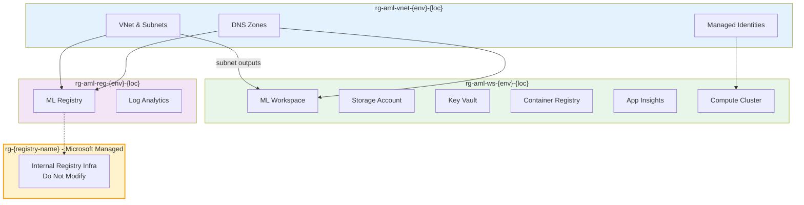

# Azure ML Infrastructure

This folder contains the complete Terraform infrastructure for the Azure ML Operations (MLOps) project. The infrastructure uses a **module orchestration approach** to deploy networking, workspace, and registry components with proper dependency management and optimized for private networking.

## 📁 **Infrastructure Architecture**

### **Module Organization**

```
infra/
├── 🎯 main.tf                     # Root orchestration file (DEPLOY FROM HERE)
├── 🔧 variables.tf                # Root variable definitions  
├── ⚙️ terraform.tfvars            # Main configuration file
├── 📤 outputs.tf                  # Aggregated outputs from all modules
├── 📋 terraform.tfstate           # State file (after deployment)
│
├── 🌐 aml-vnet/                   # Networking Foundation Module
│   ├── main.tf                    # VNet, subnets, DNS zones, managed identities
│   ├── variables.tf               # Network module variables
│   ├── outputs.tf                 # Network outputs (IDs, names, principal IDs)
│   ├── locals.tf                  # Resource naming and calculations
│   └── terraform.tfvars          # Network-specific configuration
│
├── 🏢 aml-managed-smi/            # ML Workspace Module  
│   ├── main.tf                    # Workspace, storage, Key Vault, ACR, compute
│   ├── variables.tf               # Workspace module variables
│   ├── outputs.tf                 # Workspace outputs
│   ├── locals.tf                  # Resource naming and calculations
│   ├── locals_dns.tf              # DNS zone conditional logic
│   └── terraform.tfvars          # Workspace-specific configuration
│
├── 📚 aml-registry-smi/           # ML Registry Module
│   ├── main.tf                    # Registry, Log Analytics, monitoring
│   ├── variables.tf               # Registry module variables  
│   ├── outputs.tf                 # Registry outputs
│   ├── locals.tf                  # Resource naming and calculations
│   └── terraform.tfvars          # Registry-specific configuration
│
└── 📁 modules/                    # Reusable component modules
    ├── container-registry/        # ACR module
    ├── key-vault/                 # Key Vault module
    ├── private-endpoint/          # Private endpoint module
    └── storage-account/           # Storage account module
```

## 🚦 Deployment Flow & Dependencies

This infrastructure uses a **modular orchestration** approach. The deployment order and dependencies are as follows:

### Deployment Order
1. **aml-vnet**: Deploys networking, DNS, and managed identities (foundation for all other modules)
2. **aml-managed-smi**: Deploys ML workspace, storage, Key Vault, ACR, compute, and private endpoints. Consumes outputs from `aml-vnet`.
3. **aml-registry-smi**: Deploys ML registry, Log Analytics, and private endpoint. Consumes outputs from `aml-vnet`.

### Orchestration & Dependency Diagram


### Microsoft-Managed Resource Groups
> ⚠️ **Important:** When deploying the ML Registry, Azure automatically creates a Microsoft-managed resource group (`rg-{registry-name}`) containing internal infrastructure (storage, ACR, etc.). **Never modify or delete resources in this group.**

### Key Dependency Callouts
- **aml-managed-smi** and **aml-registry-smi** both require outputs from **aml-vnet** (subnet, DNS, managed identities)
- All modules are orchestrated from the root `main.tf` for dependency management
- Microsoft-managed resource groups are created automatically for the registry and are not managed by Terraform

**Note:** Always deploy modules in the order above. Confirm outputs from `aml-vnet` before proceeding with dependent modules. All dependencies are managed via module outputs and remote state.

**Key Dependencies:**
1. **aml-vnet** creates networking foundation and managed identities
2. **aml-managed-smi** consumes VNet outputs and managed identity references  
3. **aml-registry-smi** consumes VNet outputs for private connectivity
4. All modules coordinate through root orchestration
│   └── terraform.tfvars          # Registry configuration
└── modules/                       # Reusable Terraform modules
    ├── storage-account/           # Storage account module
    ├── key-vault/                 # Key Vault module
    ├── container-registry/        # Container Registry module
    └── private-endpoint/          # Private endpoint module
```

## 🚀 Quick Start

### Prerequisites

- **Azure CLI**: Version 2.75.0+ with ML extension
- **Terraform**: Version 1.0+
- **Azure Subscription**: With appropriate permissions
- **PowerShell**: For Windows users

```bash
# Install Azure ML extension
az extension add --name ml

# Verify installations
az --version
terraform --version
```

### 1. Configure Variables

Edit `terraform.tfvars` with your specific values:

```hcl
# Purpose and Environment
purpose       = "dev"                    # Change to your environment
location      = "canadacentral"          # Change to your preferred region
location_code = "cc"                     # Update accordingly
random_string = "001"                    # Your unique identifier

# Azure Subscription (REQUIRED)
sub_id = "your-subscription-id-here"     # Replace with actual subscription ID

# User Management (REQUIRED)
user_object_id = "your-user-object-id"   # Replace with your user object ID

# Networking Configuration (Optional)
vnet_address_space    = "10.1.0.0/16"
subnet_address_prefix = "10.1.1.0/24"

# Resource Tagging (Optional)
tags = {
  environment = "dev"
  project     = "ml-platform"
  created_by  = "terraform"
  owner       = "ml-team"
}
```

### 2. Deploy Infrastructure

```bash
# Navigate to infra folder
cd infra

# Initialize Terraform
terraform init

# Review planned changes
terraform plan

# Deploy infrastructure
terraform apply
```

### 3. Verify Deployment

```bash
# Check outputs
terraform output

# Verify in Azure portal or CLI
az ml workspace list --subscription <subscription-id>
```

## 🏗️ Architecture Overview

### Module Dependencies

```
Root Orchestration (main.tf)
├── 1. aml-vnet (networking foundation)
│   ├── Virtual Network (10.1.0.0/16)
│   ├── Private Subnet (10.1.1.0/24)
│   ├── 9 Private DNS Zones
│   └── 2 Managed Identities
│
├── 2. aml-workspace (depends on aml-vnet)
│   ├── Azure ML Workspace
│   ├── Storage Account + Private Endpoint
│   ├── Key Vault + Private Endpoint
│   ├── Container Registry + Private Endpoint
│   ├── Application Insights
│   ├── Compute Cluster
│   └── Role Assignments
│
└── 3. aml-registry (depends on aml-vnet)
    ├── Azure ML Registry
    ├── Log Analytics Workspace
    └── Private Endpoint
```

### Resource Count

| Module | Resource Types | Approximate Count | Resource Group |
|--------|---------------|-------------------|----------------|
| **aml-vnet** | VNet, Subnet, DNS Zones, Identities | ~12 resources | `rg-aml-vnet-{environment}-{location-code}` |
| **aml-workspace** | Workspace, Storage, KV, ACR, AI, Compute, PE | ~25 resources | `rg-aml-ws-{environment}-{location-code}` |
| **aml-registry** | Registry, Log Analytics, PE | ~5 resources | `rg-aml-reg-{environment}-{location-code}` |
| **Microsoft Managed** | ML Registry Internal Components | ~3-5 resources | `rg-{registry-name}` (auto-created) |
| **Total** | | **~45 resources** | **4 resource groups** |

### **Microsoft Managed Resource Groups**

**Important**: The Azure ML Registry automatically creates additional infrastructure:


- **Visibility**: Appears in your subscription but is not directly manageable through Terraform
- **Lifecycle**: Automatically created when registry is deployed, removed when registry is deleted

> ⚠️ **Critical Warning**: Do not attempt to manage, modify, or delete resources in the Microsoft managed resource group as this will break the ML Registry functionality and may require Microsoft support to resolve.

## 🔧 Configuration

### Required Variables

| Variable | Description | Example |
|----------|-------------|---------|
| `sub_id` | Azure subscription ID | `"12345678-1234-1234-1234-123456789012"` |
| `user_object_id` | User's Azure AD object ID | `"87654321-4321-4321-4321-210987654321"` |

### Optional Variables

| Variable | Default | Description |
|----------|---------|-------------|
| `purpose` | `"dev"` | Environment identifier |
| `location` | `"canadacentral"` | Azure region |
| `location_code` | `"cc"` | Short region code |
| `random_string` | `"001"` | Unique identifier |
| `vnet_address_space` | `"10.1.0.0/16"` | VNet CIDR block |
| `subnet_address_prefix` | `"10.1.1.0/24"` | Subnet CIDR block |

## 📤 Outputs

The infrastructure provides comprehensive outputs for integration:

### Networking Outputs
- `vnet_id`: Virtual Network ID
- `subnet_id`: Private subnet ID
- `dns_zone_ids`: Map of all DNS zone IDs
- `resource_group_name_dns`: DNS resource group name

### ML Workspace Outputs
- `workspace_id` & `workspace_name`: ML workspace details
- `storage_account_name` & `storage_account_id`: Storage details
- `keyvault_name` & `keyvault_id`: Key Vault details
- `container_registry_name` & `container_registry_id`: ACR details
- `managed_identity_id` & `managed_identity_principal_id`: Identity details

### ML Registry Outputs
- `registry_id` & `registry_name`: Registry details
- `registry_storage_account_name`: Registry storage
- `registry_keyvault_name`: Registry Key Vault

### Summary Output
- `deployment_summary`: High-level deployment overview

## 🔐 Security Features

### Network Security
- **Private Networking**: All resources use private endpoints
- **DNS Resolution**: Custom DNS zones for service resolution
- **Network Isolation**: Managed VNet with approved outbound only

### Identity & Access
- **Managed Identities**: User-assigned identities for compute
- **RBAC**: Least privilege role assignments
- **Key Management**: Azure Key Vault for secrets

### Data Protection
- **Encryption**: Data encrypted at rest and in transit
- **Private Endpoints**: No public internet exposure
- **Access Controls**: IP restrictions and firewall rules

## 🧪 Testing & Validation

### Pre-deployment Checks
```bash
# Validate Terraform configuration
terraform validate

# Format Terraform files
terraform fmt -recursive

# Security scan (if tfsec installed)
tfsec .
```

### Post-deployment Validation
```bash
# Test workspace connectivity
az ml workspace show --name <workspace-name> --resource-group <rg-name>

# Verify private endpoints
az network private-endpoint list --resource-group <rg-name>

# Check role assignments
az role assignment list --scope <resource-scope>
```

## 🔄 Module Outputs as Inputs

The orchestration leverages module outputs for dependencies:

```hcl
# Example: Workspace module uses VNet outputs
module "aml_workspace" {
  source = "./aml-managed-smi"
  
  # Core variables
  purpose = var.purpose
  # ... other variables
  
  # Use VNet module outputs instead of variables
  subnet_id                = module.aml_vnet.subnet_id
  resource_group_name_dns  = module.aml_vnet.resource_group_name_dns
  dns_zone_blob_id        = module.aml_vnet.dns_zone_blob_id
  # ... other DNS zones
  
  depends_on = [module.aml_vnet]
}
```

## 🛠️ Troubleshooting

### Common Issues

#### 1. Authentication Errors
```bash
# Re-authenticate with Azure
az login
az account set --subscription <subscription-id>
```

#### 2. Resource Naming Conflicts
```bash
# Update random_string in terraform.tfvars
random_string = "002"  # Change to new unique value
```

#### 3. Network Connectivity Issues
```bash
# Verify private endpoint connections
az network private-endpoint list --resource-group <rg-name> --output table
```

#### 4. RBAC Permission Issues
```bash
# Check your permissions
az role assignment list --assignee <your-object-id> --output table
```

### Terraform State Issues
```bash
# Refresh state
terraform refresh

# Import existing resource (if needed)
terraform import <resource-type>.<resource-name> <azure-resource-id>

# Force unlock (if state locked)
terraform force-unlock <lock-id>
```

## 🛠️ **Troubleshooting**

### **Common Issues & Solutions**

#### 1. **Authentication Failures**
```bash
# Re-authenticate with Azure
az login
az account set --subscription "your-subscription-id"

# Verify authentication
az account show
```

#### 2. **Resource Naming Conflicts**
```bash
# Update random_string in terraform.tfvars to make names unique
random_string = "002"  # Change to new unique value

# Or check existing resources
az resource list --resource-group {resource-group-name}
```

#### 3. **Network Connectivity Issues**
```bash
# Verify private endpoint connections
az network private-endpoint list --resource-group {resource-group-name} --output table

# Check DNS resolution
nslookup {storage-account-name}.blob.core.windows.net
```

#### 4. **RBAC Permission Issues**
```bash
# Check your current permissions
az role assignment list --assignee $(az ad signed-in-user show --query id -o tsv) --output table

# Verify managed identity permissions
az role assignment list --assignee "{managed-identity-name}" --all --output table
```

#### 5. **Module Dependency Errors**
If you encounter dependency issues:
```bash
# Ensure proper deployment order
terraform apply -target=module.aml_vnet
terraform apply -target=module.aml_workspace  
terraform apply -target=module.aml_registry
```

#### 6. **Private Endpoint DNS Resolution**
```bash
# Verify DNS zones are linked to VNet
az network private-dns link vnet list --resource-group {resource-group-name} --zone-name privatelink.blob.core.windows.net

# Check A records exist
az network private-dns record-set a list --resource-group {resource-group-name} --zone-name privatelink.blob.core.windows.net
```

### **Terraform State Issues**

#### **State Lock Resolution**
```bash
# If state is locked
terraform force-unlock <lock-id>

# Alternative: refresh state
terraform refresh
```

#### **State Corruption Recovery**
```bash
# Backup current state
cp terraform.tfstate terraform.tfstate.backup

# Import existing resources if needed
terraform import azurerm_resource_group.example /subscriptions/12345.../resourceGroups/example-rg

# Refresh state to sync with Azure
terraform refresh
```

### **Deployment Validation**

#### **Pre-Deployment Checks**
```bash
# Validate configuration
terraform validate

# Check plan for issues
terraform plan -detailed-exitcode

# Verify resource availability
az provider show --namespace Microsoft.MachineLearningServices --query registrationState
```

#### **Post-Deployment Verification**
```bash
# Check resource creation
terraform output

# Verify ML workspace
az ml workspace show --name {workspace-name} --resource-group {resource-group-name}

# Test compute cluster
az ml compute show --name {compute-cluster-name} --workspace-name {workspace-name} --resource-group {resource-group-name}

# Verify registry access
az ml registry show --name {registry-name}
```

### **Performance Optimization**

#### **Parallel Deployment**
```bash
# Enable parallelism for faster deployment
terraform apply -parallelism=10
```

#### **Resource Dependencies**
Monitor deployment progress and identify bottlenecks:
- VNet creation: ~2-3 minutes
- Private endpoints: ~5-8 minutes each
- ML workspace: ~10-15 minutes
- Compute cluster: ~5-10 minutes

### **Cost Monitoring**

#### **Resource Cost Analysis**
```bash
# Check resource costs
az consumption usage list --start-date 2025-01-01 --end-date 2025-01-31

# Monitor compute costs specifically
az ml compute list --workspace-name {workspace-name} --resource-group {resource-group-name} --query '[].{Name:name,State:state,VmSize:vmSize}'
```

## 🧹 **Infrastructure Cleanup**

### **Complete Destruction** ⚠️
```bash
# CAUTION: This will destroy ALL infrastructure
terraform destroy

# Confirm with 'yes' when prompted
```

### **Selective Cleanup**
```bash
# Remove specific modules (use with caution)
terraform destroy -target=module.aml_registry
terraform destroy -target=module.aml_workspace
terraform destroy -target=module.aml_vnet
```

### **Manual Cleanup Tasks**
Some resources may require manual intervention:

#### **Storage Account Cleanup**
```bash
# List storage containers
az storage container list --account-name devstorageccnnn

# Delete specific containers if needed
az storage container delete --name container-name --account-name devstorageccnnn
```

#### **Key Vault Soft Delete**
```bash
# List deleted key vaults
az keyvault list-deleted

# Purge soft-deleted vault (if needed)
az keyvault purge --name {key-vault-name} --location {location}
```

#### **DNS Records Cleanup**
```bash
# Verify all A records are removed
az network private-dns record-set a list --resource-group {resource-group-name} --zone-name privatelink.blob.core.windows.net
```

## 📈 **Monitoring & Maintenance**

### **Regular Health Checks**
```bash
# Monitor workspace health
az ml workspace show --name {workspace-name} --resource-group {resource-group-name} --query provisioningState

# Check compute cluster status  
az ml compute list --workspace-name {workspace-name} --resource-group {resource-group-name}

# Verify private endpoint health
az network private-endpoint list --resource-group {resource-group-name} --query '[].{Name:name,State:privateLinkServiceConnections[0].privateLinkServiceConnectionState.status}'
```

### **Security Auditing**
```bash
# Review RBAC assignments
az role assignment list --scope "/subscriptions/$(az account show --query id -o tsv)/resourceGroups/{resource-group-name}"

# Check Key Vault access policies
az keyvault show --name {key-vault-name} --query properties.accessPolicies

# Monitor private endpoint connections  
az network private-endpoint list --resource-group {resource-group-name}
```

### **Update Management**
```bash
# Check for provider updates
terraform init -upgrade

# Review changes before applying
terraform plan

# Apply updates carefully
terraform apply
```

## 📝 Development

### Adding New Modules
1. Create module in appropriate location
2. Add module call to `main.tf`
3. Update dependencies with `depends_on`
4. Add outputs to `outputs.tf`
5. Update documentation

### Best Practices
- **State Management**: Use remote state for production
- **Variable Validation**: Add validation rules
- **Tagging**: Consistent resource tagging
- **Documentation**: Keep README updated
- **Testing**: Validate before applying

## 🔗 Related Documentation

- [Main Project README](../README.md)
- [Azure ML Documentation](https://docs.microsoft.com/azure/machine-learning/)
- [Terraform Azure Provider](https://registry.terraform.io/providers/hashicorp/azurerm/latest)
- [Azure Private Endpoints](https://docs.microsoft.com/azure/private-link/private-endpoint-overview)

---

**Authors**: Jose Medina Gomez & Matt Felton  
**Last Updated**: July 29, 2025  
**Version**: 1.4.0 - Production-Ready Diagnostic Settings Deployment
