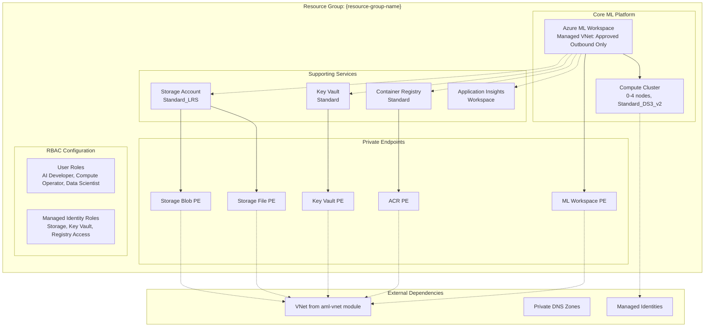

# Azure ML Workspace Infrastructure Module

This Terraform module deploys a complete, production-ready Azure Machine Learning workspace with managed virtual network, supporting services, comprehensive security, and RBAC configuration. This module creates the core ML platform for development and production workloads.

## 🎯 **Module Overview**

This module creates a secure, enterprise-ready Azure ML workspace featuring:

- **🏢 ML Workspace**: Core Azure ML workspace with managed VNet and private endpoints
- **💾 Storage Services**: Azure Storage with blob, file, table, and queue endpoints
- **🔐 Security Services**: Azure Key Vault for secrets and certificate management
- **📦 Container Registry**: Azure Container Registry for custom ML container images
- **📊 Monitoring**: Application Insights for workspace telemetry and monitoring
- **⚙️ Compute Infrastructure**: Auto-scaling compute cluster with managed identity
- **🔒 Network Security**: Private endpoints for all services with DNS integration
- **👥 RBAC Configuration**: Comprehensive role assignments for users and managed identities

## 🏗️ **Architecture**



## 📋 **Required Configuration**

### **Critical Settings to Update**

This module depends on outputs from the `aml-vnet` module. When using the root orchestration, these dependencies are automatically resolved. For standalone deployment, you must provide:

#### 1. **User Identity Configuration** 👤
```hcl
# Your Azure AD user object ID for RBAC assignments
user_object_id = "12345678-1234-1234-1234-123456789012"

# Your public IP for workspace access (optional, for additional security)
user_ip_address = "203.0.113.123/32"
```

**Get your user object ID:**
```bash
az ad signed-in-user show --query id -o tsv
```

#### 2. **Network Dependencies** 🌐
```hcl
# From aml-vnet module outputs (automatically provided in orchestrated deployment)
subnet_id = "/subscriptions/{sub}/resourceGroups/{resource-group-name}/providers/Microsoft.Network/virtualNetworks/{vnet-name}/subnets/{subnet-name}"

# DNS zone resource group (from aml-vnet module)
resource_group_name_dns = "{resource-group-name}"
```

#### 3. **Managed Identity References** 🆔
```hcl
# Compute cluster managed identity (from aml-vnet module)
compute_cluster_identity_id = "/subscriptions/{sub}/resourceGroups/{resource-group-name}/providers/Microsoft.ManagedIdentity/userAssignedIdentities/{managed-identity-name}"
compute_cluster_identity_principal_id = "87654321-4321-4321-4321-210987654321"
```

#### 4. **Environment Configuration** ⚙️
```hcl
# Environment and location settings
purpose = "dev"                    # Environment identifier
location = "canadacentral"         # Azure region
location_code = "cc"              # Short region code
random_string = "001"             # Unique identifier

# Azure subscription
sub_id = "your-subscription-id"   # Target subscription
```

## 🔑 **RBAC Configuration**

### **User Account Roles** (Applied to your Azure AD user)

| Role | Scope | Purpose |
|------|-------|---------|
| `Azure AI Developer` | Workspace | Full Azure ML development capabilities |
| `AzureML Compute Operator` | Workspace | Create and manage compute resources |
| `AzureML Data Scientist` | Workspace | Run experiments and access data |
| `Storage Blob Data Contributor` | Storage Account | Access training data and model artifacts |
| `Storage File Data Privileged Contributor` | Storage Account | Access file shares and notebooks |

### **Managed Identity Roles** (Applied to compute cluster identity)

| Role | Scope | Purpose |
|------|-------|---------|
| `AzureML Data Scientist` | Workspace | Execute ML training jobs |
| `Storage Blob Data Contributor` | Storage Account | Read/write training data and artifacts |
| `Storage File Data Privileged Contributor` | Storage Account | **NEW**: Support for compute instances and file access |
| `Key Vault Secrets User` | Key Vault | Access secrets during training |
| `AzureML Registry User` | Registry | Access shared models and components |

### **Workspace System Identity Roles** (Applied to workspace managed identity)

| Role | Scope | Purpose |
|------|-------|---------|
| `Reader` | Resource Group | Read resource metadata |
| `Azure AI Enterprise Network Connection Approver` | Resource Group | Approve private endpoint connections |
```bash
az account show --query id -o tsv
```

## Optional Customizations

### Location and Naming
- `location`: Azure region for resources (default: canadacentral)
- `location_code`: Short code for the region (e.g., "cc" for Canada Central)
- `purpose`: Environment identifier (e.g., "dev", "test", "prod")
- `random_string`: Unique identifier to ensure resource name uniqueness

### Compute Configuration
- `compute_cluster_min_nodes`: Minimum number of nodes in the compute cluster (default: 2)
- `compute_cluster_max_nodes`: Maximum number of nodes in the compute cluster (default: 2)
- `compute_cluster_vm_size`: VM size for compute nodes (default: Standard_DS3_v2)

### Tags
Customize the `tags` section to match your organization's tagging strategy.

## Architecture

This module creates the following Azure resources:

```
┌─────────────────────────────────────────────────────────┐
│                   Resource Group                        │
│ ┌─────────────────────────────────────────────────────┐ │
│ │              Azure ML Workspace                     │ │
│ │  ┌─────────────────────────────────────────────────┐│ │
│ │  │         Managed Virtual Network                 ││ │
│ │  │  - Isolation Mode: allow_only_approved_outbound ││ │
│ │  │  - Private endpoints for all services           ││ │
│ │  │  - Compute cluster with managed identity        ││ │
│ │  └─────────────────────────────────────────────────┘│ │
│ └─────────────────────────────────────────────────────┘ │
│                                                         │
│  Supporting Services:                                   │
│  - Storage Account (blob, file, table, queue)           │
│  - Key Vault (secrets, keys, certificates)              │
│  - Container Registry (Docker images)                   │
│  - Application Insights (monitoring)                    │
│  - Log Analytics Workspace (logging)                    │
└─────────────────────────────────────────────────────────┘
```

## Security Features

- **Network Isolation**: All services communicate via private endpoints
- **Managed Identity**: User-assigned managed identity for compute resources
- **RBAC**: Automatic role assignments for workspace and compute operations
- **Key Management**: Azure Key Vault integration for secrets
- **Monitoring**: Application Insights and Log Analytics integration

## Role Assignments

The module automatically creates the following role assignments:

**User Account:**
- Azure AI Developer (Workspace scope)
- AzureML Compute Operator (Workspace scope) 
- AzureML Data Scientist (Workspace scope)

**Managed Identity (Compute Cluster):**
- AzureML Data Scientist (Workspace scope)
- Storage Blob Data Contributor (Storage Account scope)
- Key Vault Secrets User (Key Vault scope)

## Prerequisites

- Azure CLI installed and authenticated
- Terraform >= 1.0 installed
- Existing VNet and subnet for private endpoints
- Private DNS zones configured and linked to your VNet (deployed via `aml-vnet` module)
- Appropriate Azure RBAC permissions to create resources
- Azure subscription with sufficient quota for ML resources

## Deployment Steps

1. **Initialize Terraform:**
```bash
terraform init
```

2. **Review and customize terraform.tfvars:**
```bash
# Copy the example file and customize
cp terraform.tfvars.example terraform.tfvars
# Edit terraform.tfvars with your specific values
```

3. **Plan the deployment:**
```bash
terraform plan
```

4. **Apply the configuration:**
```bash
terraform apply
```

5. **Verify deployment:**
```bash
# Check workspace status
az ml workspace show --name <workspace-name> --resource-group <resource-group>

# List compute clusters
az ml compute list --workspace-name <workspace-name> --resource-group <resource-group>
```

## Post-Deployment Configuration

### Configure IP Whitelisting
After deployment, configure network access:

1. **Workspace Network ACLs:**
```bash
# Add your IP to workspace access
az ml workspace update \
  --name <workspace-name> \
  --resource-group <resource-group> \
  --public-network-access Enabled \
  --allowed-ips <your-ip>/32
```

2. **Storage Account Network ACLs:**
```bash
# Add your IP to storage account
az storage account network-rule add \
  --account-name <storage-account-name> \
  --resource-group <resource-group> \
  --ip-address <your-ip>
```

## Resources Created

This module creates the following Azure resources:

### Core Infrastructure
- **Resource Group**: Container for all ML workspace resources
- **Log Analytics Workspace**: Centralized logging and monitoring
- **Application Insights**: Application performance monitoring

### ML Workspace Components  
- **Azure ML Workspace**: Main ML workspace with managed VNet
- **User-Assigned Managed Identity**: Created by `aml-vnet` module for compute resources

### Supporting Services
- **Azure Container Registry**: Container image storage
- **Storage Account**: Data and artifact storage with multiple endpoints
- **Key Vault**: Secure secrets and key management

### Private Connectivity
- **7 Private Endpoints**: Secure connectivity for all services
  - Storage Account (blob, file, table, queue)
  - Key Vault
  - Container Registry  
  - ML Workspace

### Security & Access
- **Role Assignments**: Granular RBAC with individual resource scoping
  - User roles: Workspace-scoped permissions
  - Compute identity roles: Individual resource-scoped permissions (follows principle of least privilege)
- **Network Security**: Private endpoint connectivity only
- **Managed Identity Integration**: References user-assigned identity from `aml-vnet` module

## Outputs

The module provides the following outputs:

- `workspace_name`: Name of the created ML workspace
- `workspace_id`: Full resource ID of the ML workspace
- `resource_group_name`: Name of the created resource group

## Troubleshooting

### Common Issues

1. **DNS Resolution Issues:**
   - Ensure private DNS zones are properly linked to your VNet
   - Verify DNS zone names match exactly

2. **Permission Errors:**
   - Check if your user has sufficient RBAC permissions
   - Verify compute managed identity role assignments are properly scoped to individual resources
   - Ensure the managed identity from `aml-vnet` module exists and is accessible

3. **Network Connectivity:**
   - Confirm subnet has sufficient IP addresses
   - Check private endpoint connectivity and DNS resolution
   - Verify private DNS zones are properly linked to VNet

### Useful Commands

```bash
# Check private endpoint status
az network private-endpoint list --resource-group <resource-group>

# Verify DNS resolution
nslookup <workspace-name>.workspace.<region>.api.azureml.ms

# Check role assignments (individual resource scope)
az role assignment list --scope <resource-scope>

# Check managed identity details
az identity show --name "${purpose}-mi-cluster" --resource-group <dns-resource-group>

# Monitor deployment logs
az monitor activity-log list --resource-group <resource-group>
```

## Clean Up

To remove all resources:

```bash
terraform destroy
```

**Warning**: This will permanently delete all resources including data stored in the storage account and any trained models.

## Dependencies

This module depends on:
- `aml-vnet` module for networking infrastructure and managed identities
- Private DNS zones for name resolution (created by `aml-vnet`)
- User-assigned managed identity for compute cluster (created by `aml-vnet`)
- Existing Azure subscription with proper quotas

## Module Integration

This module works in conjunction with the `aml-vnet` module:

1. **Deploy `aml-vnet` first**: Creates VNet, subnet, DNS zones, and managed identities
2. **Deploy `aml-managed-smi` second**: Creates ML workspace and references resources from step 1

The modules are designed to use consistent variable naming:
- Both use `purpose`, `location_code`, `random_string` for naming consistency
- `resource_group_name_dns` references the resource group containing DNS zones and managed identities
- Managed identity naming follows `${purpose}-mi-cluster` pattern

## Module Structure

```
aml-managed-smi/
├── main.tf                 # Main Terraform configuration
├── variables.tf            # Variable definitions
├── outputs.tf              # Output definitions  
├── terraform.tfvars        # Configuration values
├── providers.tf            # Provider configuration
└── README.md              # This documentation
```

---

**Authors**: Jose Medina Gomez & Matt Felton  
**Last Updated**: July 29, 2025  
**Version**: 1.6.0 - Production-Ready Diagnostic Settings Deployment
