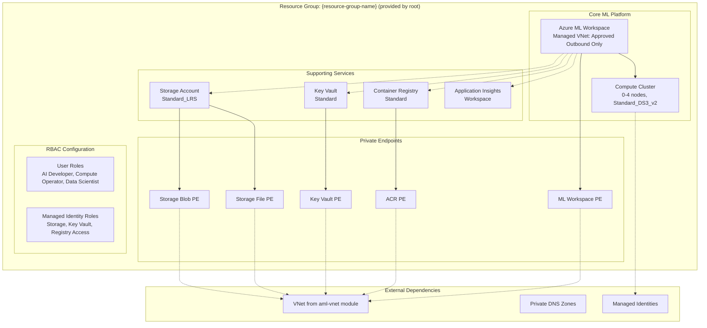

# Azure ML Workspace Infrastructure Module

This Terraform module deploys a complete, production-ready Azure Machine Learning workspace with managed virtual network, supporting services, comprehensive security, and RBAC configuration. This module assumes the resource group already exists and is passed in by the root module. It creates the core ML platform for development and production workloads.

## Table of Contents

### Overview
- [Module Overview](#module-overview)
- [Architecture](#architecture)

### Configuration
- [Required Configuration](#required-configuration)
  - [Critical Settings to Update](#critical-settings-to-update)
- [RBAC Configuration](#-rbac-configuration)
  - [Human User Roles](#human-user-roles)
  - [Managed Identity Roles](#managed-identity-roles-applied-to-compute-cluster-identity)
  - [Workspace User-Assigned Identity Roles](#workspace-user-assigned-identity-roles-applied-preprovisioning)
- [Optional Customizations](#optional-customizations)

### Security
- [Security Features](#security-features)
  - [Role Assignments](#role-assignments)

### Deployment
- [Prerequisites](#prerequisites)
- [Deployment Steps](#deployment-steps)
- [Post-Deployment Configuration](#post-deployment-configuration)

### Resources & Outputs
- [Resources Created](#resources-created)
- [Outputs](#outputs)

### Troubleshooting & Cleanup
- [Troubleshooting](#troubleshooting)
  - [Common Issues](#common-issues)
  - [Common Deployment Issues](#common-deployment-issues)
  - [Diagnostic Commands](#diagnostic-commands)
- [Destroy behavior and verification](#destroy-behavior-and-verification)
- [Clean Up](#clean-up)

### Integration
- [Dependencies](#dependencies)
- [Module Integration](#module-integration)
- [Module Structure](#module-structure)

---

## Module Overview

This module creates a secure, enterprise-ready Azure ML workspace featuring:

- ML Workspace: Core Azure ML workspace with managed VNet and private endpoints
- Storage Services: Azure Storage with blob, file, table, and queue endpoints
- Security Services: Azure Key Vault for secrets and certificate management
- Container Registry: Azure Container Registry for custom ML container images
- Monitoring: Application Insights for workspace telemetry and monitoring
- Compute Infrastructure: Auto-scaling compute cluster with managed identity
- Network Security: Private endpoints for all services with DNS integration
- RBAC Configuration: Managed identity role assignments only; human-user roles are centralized in the root module

## Architecture



## Required Configuration

### **Critical Settings to Update**

This module depends on an existing resource group name and network inputs. When using the root orchestration, these dependencies are automatically resolved. For standalone deployment, you must provide:

#### 1. Identity & Access
Human-user (data scientist) RBAC is assigned in the root module (Step 12 barrier). This module does not accept user IDs and does not create human role assignments.

#### 2. Network Dependencies
```hcl
# Required network inputs (typically provided by root orchestration)
subnet_id = "/subscriptions/{sub}/resourceGroups/{resource-group-name}/providers/Microsoft.Network/virtualNetworks/{vnet-name}/subnets/{subnet-name}"

# DNS zone resource group (shared DNS RG recommended)
resource_group_name_dns = "{resource-group-name}"
```

#### 3. Managed Identity References
```hcl
# Compute cluster managed identity (passed from root orchestration)
compute_cluster_identity_id = "/subscriptions/{sub}/resourceGroups/{workspace-rg}/providers/Microsoft.ManagedIdentity/userAssignedIdentities/{managed-identity-name}"
compute_cluster_identity_principal_id = "87654321-4321-4321-4321-210987654321"
```

#### 4. Environment Configuration
```hcl
# Environment and location settings
purpose = "dev"                    # Environment identifier
location = "canadacentral"         # Azure region
location_code = "cc"              # Short region code
naming_suffix = "01"              # Deterministic suffix for naming

# Azure subscription
sub_id = "your-subscription-id"   # Target subscription

# Existing resource group to deploy into
resource_group_name = "rg-aml-ws-dev-cc001"
```

## 🔑 **RBAC Configuration**

### **Human User Roles**
Managed in root only. See `infra/main.tf` Step 12 for the centralized assignments (workspace + storage + registry). This module does not create any human-user RBAC.

### **Managed Identity Roles** (Applied to compute cluster identity)

| Role | Scope | Purpose |
|------|-------|---------|
| `AzureML Data Scientist` | Workspace | Execute ML training jobs |
| `Storage Blob Data Contributor` | Storage Account | Read/write training data and artifacts |
| `Storage File Data Privileged Contributor` | Storage Account | **NEW**: Support for compute instances and file access |
| `Key Vault Secrets Officer` | Key Vault | Required for AML workspace UAMI to set secrets during image builds and job runs. |
| `AzureML Registry User` | Registry | Access shared models and components |

### **Workspace User-Assigned Identity Roles** (applied pre/provisioning)

| Role | Scope | Purpose |
|------|-------|---------|
| `Reader` | Resource Group | Read resource metadata |
| `Azure AI Enterprise Network Connection Approver` | Resource Group | Approve private endpoint connections |
```bash
az account show --query id -o tsv
```

#### Note on User-Assigned Managed Identities (UAMI)

- If you configure compute to use a User-Assigned Managed Identity (UAMI) or set a default compute for image creation, the **workspace UAMI must be able to read the compute UAMI resource** to reference/assign it.
- When the compute UAMI is created in the same workspace resource group, this requirement is satisfied by the existing **Reader** role assigned to the workspace UAMI at the workspace RG scope.
- If the compute UAMI lives in a different resource group or subscription, you must grant the workspace UAMI at least **Reader** on that scope (either directly on the UAMI resource or on its resource group) before assigning it as default/image build compute.

Additional runtime note (jobs and clients):
- If your job code initializes Azure SDK clients (e.g., MLClient, Registry client) using `DefaultAzureCredential` and relies on `DEFAULT_IDENTITY_CLIENT_ID`, set that variable to the compute UAMI client ID so the job authenticates as the compute identity. Otherwise, it may default to the workspace UAMI and RBAC will be enforced against the workspace identity instead.
- Ensure the chosen identity (compute UAMI or workspace UAMI) has the required roles for the operations your job performs (e.g., AzureML Registry User, Storage Blob Data Contributor, Key Vault Secrets User, AzureML Data Scientist, etc.).


## Optional Customizations

### Location and Naming
- `location`: Azure region for resources (default: canadacentral)
- `location_code`: Short code for the region (e.g., "cc" for Canada Central)
- `purpose`: Environment identifier (e.g., "dev", "test", "prod")
- `naming_suffix`: Deterministic suffix to ensure resource name consistency

### Compute Configuration
Scale and size are currently set in code for stability (cluster min=2, max=4, Standard_F8s_v2). Expose as variables if you need to tune.

### Tags
Customize the `tags` section to match your organization's tagging strategy.

## Architecture

This module creates the following Azure resources:

```
┌─────────────────────────────────────────────────────────┐
│                   Resource Group                        │
│ ┌─────────────────────────────────────────────────────┐ │
│ │              Azure ML Workspace                     │ │
│ │  ┌─────────────────────────────────────────────────┐│ │
│ │  │         Managed Virtual Network                 ││ │
│ │  │  - Isolation Mode: allow_only_approved_outbound ││ │
│ │  │  - Private endpoints for all services           ││ │
│ │  │  - Compute cluster with managed identity        ││ │
│ │  └─────────────────────────────────────────────────┘│ │
│ └─────────────────────────────────────────────────────┘ │
│                                                         │
│  Supporting Services:                                   │
│  - Storage Account (blob, file, table, queue)           │
│  - Key Vault (secrets, keys, certificates)              │
│  - Container Registry (Docker images)                   │
│  - Application Insights (monitoring)                    │
│  - Log Analytics Workspace (logging)                    │
└─────────────────────────────────────────────────────────┘
```

## Security Features

- **Network Isolation**: All services communicate via private endpoints
- **Managed Identity**: User-assigned managed identity for compute resources
- **RBAC**: Automatic role assignments for workspace and compute operations
- **Key Management**: Azure Key Vault integration for secrets
- **Monitoring**: Application Insights and Log Analytics integration

### Role Assignments

The module automatically creates the following role assignments for non-human identities only:

**Managed Identity (Compute Cluster):**
- AzureML Data Scientist (Workspace scope)
- Storage Blob Data Contributor (Storage Account scope)
- Storage File Data Privileged Contributor (Storage Account scope)
- Key Vault Secrets Officer (Key Vault scope, required for AML workspace UAMI to set secrets)
- AcrPull/AcrPush (Registry scope)

**Workspace UAMI (Pre-provisioning to avoid 403s):**
- Key Vault Secrets Officer, Key Vault Reader (on workspace Key Vault)
- Reader, Azure AI Enterprise Network Connection Approver, Azure AI Administrator (on workspace RG)

Note: Key Vault Reader is required for management‑plane `vaults/read` during workspace provisioning to avoid 403 errors; Secrets User covers data‑plane access later in lifecycle.

## Prerequisites

- Azure CLI installed and authenticated
- Terraform >= 1.0 installed
- Existing VNet and subnet for private endpoints
- Private DNS zones configured and linked to your VNet (shared zones created in root; per-env zones disabled)
- Appropriate Azure RBAC permissions to create resources
- Azure subscription with sufficient quota for ML resources

## Deployment Steps

1. **Initialize Terraform:**
```bash
terraform init
```

2. **Review and customize terraform.tfvars:**
```bash
# Copy the example file and customize
cp terraform.tfvars.example terraform.tfvars
# Edit terraform.tfvars with your specific values
```

3. **Plan the deployment (from root):**
```bash
terraform plan
```

4. **Apply the configuration (from root):**
```bash
terraform apply
```

5. **Verify deployment:**
```bash
# Check workspace status
az ml workspace show --name <workspace-name> --resource-group <resource-group>

# List compute clusters
az ml compute list --workspace-name <workspace-name> --resource-group <resource-group>
```

## Post-Deployment Configuration

### Configure IP Whitelisting
After deployment, configure network access:

1. **Workspace Network ACLs:**
```bash
# Add your IP to workspace access
az ml workspace update \
  --name <workspace-name> \
  --resource-group <resource-group> \
  --public-network-access Enabled \
  --allowed-ips <your-ip>/32
```

2. **Storage Account Network ACLs:**
```bash
# Add your IP to storage account
az storage account network-rule add \
  --account-name <storage-account-name> \
  --resource-group <resource-group> \
  --ip-address <your-ip>
```

## Resources Created

This module creates the following Azure resources:

### Core Infrastructure
- **Resource Group**: Provided by root; container for all ML workspace resources
- **Log Analytics Workspace**: Centralized logging and monitoring
- **Application Insights**: Application performance monitoring

### ML Workspace Components  
- **Azure ML Workspace**: Main ML workspace with managed VNet
- **User-Assigned Managed Identity**: Provided by root orchestration for compute resources

### Supporting Services
- **Azure Container Registry**: Container image storage
- **Storage Account**: Data and artifact storage with multiple endpoints
- **Key Vault**: Secure secrets and key management

### Private Connectivity
- **7 Private Endpoints**: Secure connectivity for all services
  - Storage Account (blob, file, table, queue)
  - Key Vault
  - Container Registry  
  - ML Workspace

### Security & Access
- **Role Assignments**: Granular RBAC with individual resource scoping
  - User roles: Workspace-scoped permissions
  - Compute identity roles: Individual resource-scoped permissions (follows principle of least privilege)
- **Network Security**: Private endpoint connectivity only
- **Managed Identity Integration**: References user-assigned identity passed from root orchestration

## Outputs

The module provides the following outputs:

- `workspace_name`: Name of the created ML workspace
- `workspace_id`: Full resource ID of the ML workspace
- `resource_group_name`: Name of the created resource group
  (now provided by the root module)

## Troubleshooting

### Common Issues

1. **DNS Resolution Issues:**
   - Ensure private DNS zones are properly linked to your VNet
   - Verify DNS zone names match exactly

2. **Permission Errors:**
   - Check if your user has sufficient RBAC permissions
   - Verify compute managed identity role assignments are properly scoped to individual resources
   - Ensure the managed identity from `aml-vnet` module exists and is accessible

3. **Network Connectivity:**
   - Confirm subnet has sufficient IP addresses
   - Check private endpoint connectivity and DNS resolution
   - Verify private DNS zones are properly linked to VNet

### Useful Commands

```bash
# Check private endpoint status
az network private-endpoint list --resource-group <resource-group>

# Verify DNS resolution
nslookup <workspace-name>.workspace.<region>.api.azureml.ms

# Check role assignments (individual resource scope)
az role assignment list --scope <resource-scope>

# Check managed identity details
az identity show --name "${purpose}-mi-cluster" --resource-group <dns-resource-group>

# Monitor deployment logs
az monitor activity-log list --resource-group <resource-group>
```

## Destroy behavior and verification

This module permanently deletes the ML workspace during `terraform destroy` using the ML CLI, matching the code in `main.tf` (local-exec on the workspace resource).

- Exact command invoked:
  ```powershell
  az ml workspace delete --name <workspace-name> --resource-group <resource-group> --permanently-delete --yes
  ```
- The script ensures the `ml` CLI extension is installed and sets the subscription from the resource ID before deletion.
- Expect a several-minute delay; logs include: `[AML Purge] Workspace permanently deleted.`
- Verify name availability after destroy:
  ```powershell
  az ml workspace list --query "[?name=='<workspace-name>'].[name,resourceGroup]" -o table
  ```

## 🔧 Troubleshooting

### **Common Deployment Issues**

#### **Key Vault Soft-Delete Conflicts**

**Issue**: Deployment fails with `409 Conflict` for Key Vault diagnostic settings:
```
Error: A resource with the ID ".../Microsoft.KeyVault/vaults/kvdevcc002/providers/Microsoft.Insights/diagnosticSettings/kvdevcc002-diagnostics" already exists
```

**Root Cause**: Azure Key Vaults use soft-delete protection. Previous deployments may have left Key Vaults in soft-deleted state.

**Solution**: Purge the soft-deleted Key Vault before deployment:
```bash
# List soft-deleted Key Vaults in your subscription
az keyvault list-deleted --query "[].{Name:name, Location:properties.location, DeletionDate:properties.deletionDate}" --output table

# Purge the conflicting Key Vault (replace with actual name and location)
az keyvault purge --name kvdevcc002 --location canadacentral
```

**Prevention**: Always purge Key Vaults when cleaning up test environments.

#### **Managed Identity Dependencies**

**Issue**: Compute cluster fails to deploy due to missing managed identity.

**Solution**: Ensure `aml-vnet` module is deployed first and outputs are properly referenced:
```hcl
compute_cluster_identity_id  = var.compute_cluster_identity_id
compute_cluster_principal_id = var.compute_cluster_principal_id
```

#### **Private Endpoint Connection Issues**

**Issue**: Services not accessible through private endpoints.

**Solutions**:
- Verify DNS zone links exist in the VNet
- Check private endpoint approval status
- Validate firewall rules allow Azure services

### **Diagnostic Commands**

```bash
# Check Key Vault status
az keyvault show --name {key-vault-name} --query "{Name:name, State:properties.provisioningState}"

# Verify managed identity assignment
az ml compute show --name cpu-cluster-uami --workspace-name {workspace-name} --resource-group {resource-group}

# Check private endpoint connections
az network private-endpoint list --resource-group {resource-group-name}

# Monitor workspace deployment
az ml workspace show --name {workspace-name} --resource-group {resource-group}
```

## Clean Up

To remove all resources:

```bash
terraform destroy
```

**Warning**: This will permanently delete all resources including data stored in the storage account and any trained models.

## Dependencies

This module depends on:
- Networking infrastructure (VNet/subnet) provisioned by root or a separate network module
- Private DNS zones for name resolution (shared DNS RG is recommended and provided by root in this repo)
- User-assigned managed identity for compute cluster (created in root and passed in)
- Existing Azure subscription with proper quotas

## Module Integration

This module works in conjunction with the root orchestration:

1. **Deploy networking + shared DNS**: Creates VNet, subnet, and DNS zones
2. **Create compute UAMI in workspace RG**: Root creates and passes identity ID/principal ID
3. **Deploy `aml-managed-smi`**: Creates ML workspace and references resources from prior steps

The modules are designed to use consistent variable naming:
- Both use `purpose`, `location_code`, `naming_suffix` for naming consistency
- `resource_group_name_dns` references the resource group containing shared DNS zones
- Managed identity naming follows `${purpose}-mi-compute` pattern

## Module Structure

```
aml-managed-smi/
├── main.tf                 # Main Terraform configuration
├── variables.tf            # Variable definitions
├── outputs.tf              # Output definitions  
├── terraform.tfvars        # Configuration values
├── providers.tf            # Provider configuration
└── README.md              # This documentation
```

---

**Authors**: Jose Medina Gomez & Matt Felton  
**Last Updated**: July 29, 2025  
**Version**: 1.4.0 - Production-Ready Diagnostic Settings Deployment
