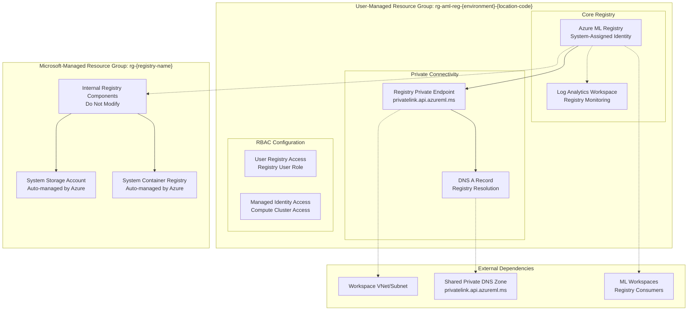

# Azure ML Registry Infrastructure Module

This Terraform module deploys an Azure Machine Learning Registry with private network connectivity, monitoring, and RBAC configuration. The registry enables centralized model and component sharing across multiple Azure ML workspaces.

## Table of Contents

### Overview
- [Module Overview](#module-overview)
- [Architecture](#architecture)
  - [Microsoft Managed Resource Groups](#important-microsoft-managed-resource-groups)

### Configuration
- [Required Configuration](#required-configuration)
  - [Critical Settings to Update](#critical-settings-to-update)
- [RBAC Configuration](#rbac-configuration)
  - [User Registry Access](#user-registry-access)
  - [Managed Identity Access](#managed-identity-access)
- [Optional Customizations](#optional-customizations)

### Features & Usage
- [Registry Features](#registry-features)
  - [Asset Types Supported](#asset-types-supported)
  - [Private Network Integration](#private-network-integration)
  - [Monitoring & Logging](#monitoring--logging)
- [Usage Examples](#usage-examples)
  - [Accessing Registry from Workspace](#accessing-registry-from-workspace)
  - [Sharing Models via Registry](#sharing-models-via-registry)
- [Deployment Considerations](#deployment-considerations)

### Security
- [Security Features](#security-features)
- [Role Assignments](#role-assignments)

### Deployment
- [Prerequisites](#prerequisites)
- [Deployment Steps](#deployment-steps)
- [Post-Deployment Configuration](#post-deployment-configuration)

### Resources & Outputs
- [Resources Created](#resources-created)
- [Outputs](#outputs)

### Troubleshooting & Cleanup
- [Troubleshooting](#troubleshooting)
  - [Common Issues](#common-issues)
  - [Common Deployment Issues](#common-deployment-issues)
  - [Diagnostic Commands](#diagnostic-commands)
- [Clean Up](#clean-up)

### Integration
- [Dependencies](#dependencies)
- [Module Structure](#module-structure)
- [Related Modules](#related-modules)
- [Best Practices](#best-practices)

---

## Module Overview

This module creates a secure, centralized Azure ML Registry featuring:

- ML Registry: Central repository for models, components, and environments
- Private Connectivity: Private endpoint for secure access from workspaces
- Monitoring: Log Analytics workspace for registry operations monitoring  
- System Identity: System-assigned managed identity for registry operations
- RBAC Integration: Role assignments for users and compute identities
- DNS Integration: Proper DNS resolution for private endpoints

## Architecture



### Important: Microsoft Managed Resource Groups

When you deploy an Azure ML Registry, Azure automatically creates a **Microsoft managed resource group** containing internal infrastructure components:

- **Resource Group Name**: `rg-{registry-name}` (auto-generated by Azure)
- **Contains**: System storage account, container registry, and other internal components
- **Management**: Fully managed by Microsoft - **NEVER modify, delete, or manage these resources**
- **Lifecycle**: Created automatically when registry deploys, removed when registry is deleted
- **Permissions**: You'll see this resource group in your subscription but should not interact with it

> Critical Warning: Modifying or deleting resources in the Microsoft managed resource group (`rg-{registry-name}`) will break your ML Registry and may require Microsoft support to resolve. Always work only with the user-managed resource group (`rg-aml-reg-{environment}-{location-code}`).

Outbound rules & connectivity: Workspaces connect to registries over managed private endpoints created by user‑defined outbound rules in the workspace (destination.subresourceTarget = "amlregistry"). This module exposes the registry resource ID for those rules.

Role assignment workaround (pre‑authorization): In private‑only deployments, creating the managed private endpoint requires the platform to read the registry’s Microsoft‑managed resources (for example, the managed ACR). To avoid permission errors, this module sets the registry property `properties.managedResourceGroupSettings.assignedIdentities` with your deployment principal’s objectId. This pre‑authorizes the identity over the registry’s managed resource group so the endpoint can be created successfully. Effectively, this grants the identity Azure AI Administrator permissions scoped to the registry’s Microsoft‑managed resource group, enabling the required metadata reads during endpoint creation.

## Required Configuration

### **Critical Settings to Update**

This module depends on network inputs (subnet ID, DNS RG) provided by the root orchestration. When using the root, these dependencies are automatically resolved.

#### 1. User Identity Configuration
```hcl
# Your Azure AD user object ID for registry access
 
```

**Get your user object ID:**
```bash
az ad signed-in-user show --query id -o tsv
```

#### 2. Network Dependencies
```hcl
# From root networking (automatically provided in orchestrated deployment)
subnet_id = "/subscriptions/{sub}/resourceGroups/{resource-group-name}/providers/Microsoft.Network/virtualNetworks/{vnet-name}/subnets/{subnet-name}"

# DNS zone resource group (shared DNS RG)  
resource_group_name_dns = "{resource-group-name}"

# VNet location for private endpoint
workload_vnet_location = "canadacentral"
workload_vnet_location_code = "cc"
```

#### 3. Managed Identity Access
```hcl
# Compute cluster identity for registry access (passed from workspace/root)
compute_cluster_identity_principal_id = "87654321-4321-4321-4321-210987654321"
```

#### 4. Environment Configuration
```hcl
# Environment and location settings
purpose = "dev"                    # Environment identifier
location = "canadacentral"         # Azure region for registry
location_code = "cc"              # Short region code
naming_suffix = "01"              # Deterministic suffix for naming

# Azure subscription
sub_id = "your-subscription-id"   # Target subscription
```

## RBAC Configuration

### **User Registry Access**
| Role | Scope | Purpose |
|------|-------|---------|
| [AzureML Registry User](https://learn.microsoft.com/azure/role-based-access-control/built-in-roles/ai-machine-learning#azureml-registry-user) | Registry | Access models, components, and environments |

### **Managed Identity Access** 
| Role | Scope | Purpose |
|------|-------|---------|
| [AzureML Registry User](https://learn.microsoft.com/azure/role-based-access-control/built-in-roles/ai-machine-learning#azureml-registry-user) | Registry | Allow compute clusters to access shared assets |

## Registry Features

### **Asset Types Supported**
- **Models**: Trained ML models with metadata and versioning
- **Components**: Reusable pipeline components and scripts
- **Environments**: Standardized runtime environments for training and inference
- **Data Assets**: Shared datasets and data references

### **Private Network Integration**
- **Private Endpoint**: Secure access via `privatelink.api.azureml.ms`
- **DNS Resolution**: Automatic DNS A record creation for private endpoint
- **VNet Integration**: Seamless connectivity from ML workspaces in same VNet

### **Monitoring & Logging**
- **Log Analytics**: Dedicated workspace for registry operations
- **Activity Logging**: Track registry access and modifications
- **Diagnostics**: Enable detailed logging for troubleshooting

## Usage Examples

### **Accessing Registry from Workspace**
```python
from azure.ai.ml import MLClient
from azure.identity import DefaultAzureCredential

# Connect to registry
ml_client = MLClient(
    credential=DefaultAzureCredential(),
    registry_name="{registry-name}"
)

# List available models
models = ml_client.models.list()
for model in models:
    print(f"Model: {model.name}, Version: {model.version}")
```

### **Sharing Models via Registry**
```python
# Register model to registry
ml_client.models.create_or_update(
    model=Model(
        name="taxi-fare-model",
        path="./model",
        description="Taxi fare prediction model"
    )
)
```

## Deployment Considerations

### **Performance**
- **Region Placement**: Deploy registry in same region as primary workspaces
- **Network Latency**: Private endpoints provide low-latency access
- **Caching**: Registry caches frequently accessed assets

### **Security**
- **Private Access Only**: No public endpoint access
- **Identity-Based Auth**: Uses Azure AD for authentication
- **Network Isolation**: Traffic stays within private network

### **Scalability**
- **Multi-Workspace**: Single registry can serve multiple workspaces
- **Version Management**: Automatic versioning of all assets
- **Global Replication**: Can replicate to other regions if needed

## Optional Customizations

### Location and Naming
- `location`: Azure region for resources (default: canadacentral)
- `location_code`: Short code for the region (e.g., "cc" for Canada Central)
- `purpose`: Environment identifier (e.g., "dev", "test", "prod")
- `naming_suffix`: Deterministic suffix to ensure resource name consistency

### Tags
Customize the `tags` section to match your organization's tagging strategy.

## Architecture

This module creates the following Azure resources:

```
┌─────────────────────────────────────────────────────────┐
│                   Resource Group                        │
│ ┌─────────────────────────────────────────────────────┐ │
│ │            Azure ML Registry                        │ │
│ │  - System-assigned managed identity                 │ │
│ │  - Private network access only                      │ │
│ │  - System-managed storage (Standard_LRS)            │ │
│ │  - System-managed ACR (Premium SKU)                 │ │
│ └─────────────────────────────────────────────────────┘ │
│                                                         │
│  Supporting Services:                                   │
│  - Log Analytics Workspace (monitoring)                 │
│  - Private Endpoint (secure connectivity)               │
└─────────────────────────────────────────────────────────┘
```

## Security Features

- **Network Isolation**: Registry accessible only via private endpoint
- **System-Managed Identity**: Automatic identity management for registry operations
- **Private Endpoint**: Secure connectivity from your VNet
- **Premium ACR**: High-performance container registry with security features
- **Monitoring**: Log Analytics integration for audit and monitoring

## Role Assignments

The module automatically creates the following role assignments:

**User Account:**
- [Azure AI Developer](https://learn.microsoft.com/azure/role-based-access-control/built-in-roles/ai-machine-learning#azure-ai-developer) (Registry scope)
- [AzureML Registry User](https://learn.microsoft.com/azure/role-based-access-control/built-in-roles/ai-machine-learning#azureml-registry-user) (Registry scope)

**Registry System Identity:**
- [Contributor](https://learn.microsoft.com/azure/role-based-access-control/built-in-roles#contributor) (Resource Group scope) - for managing system resources

## Prerequisites

- Azure CLI installed and authenticated
- Terraform >= 1.0 installed
- Existing VNet and subnet for private endpoints
- Private DNS zones configured and linked to your VNet (shared DNS RG)
- Appropriate Azure RBAC permissions to create resources
- Azure subscription with sufficient quota for ML resources

## Deployment Steps

1. **Initialize Terraform:**
```bash
terraform init
```

2. **Review and customize terraform.tfvars:**
```bash
# Copy the example file and customize
cp terraform.tfvars.example terraform.tfvars
# Edit terraform.tfvars with your specific values
```

3. **Plan the deployment:**
```bash
terraform plan
```

4. **Apply the configuration:**
```bash
terraform apply
```

5. **Verify deployment:**
```bash
# Check registry status
az ml registry show --name <registry-name> --resource-group <resource-group>

# List registry models (if any)
az ml model list --registry-name <registry-name>
```

## Post-Deployment Configuration

### Configure Registry Access
After deployment, the registry is accessible only via private endpoint from your VNet:

1. **Verify Private Endpoint Connectivity:**
```bash
# Test DNS resolution from a VM in your VNet
nslookup <registry-name>.privatelink.api.azureml.ms
```

2. **Connect from Azure ML Workspace:**
```bash
# Register the registry in your workspace
az ml registry connect --name <registry-name> --workspace-name <workspace-name>
```

## Resources Created

This module creates the following Azure resources:

### **User-Managed Infrastructure** (`rg-aml-reg-{environment}-{location-code}`)
- **Resource Group**: Container for user-managed registry resources
- **Log Analytics Workspace**: Centralized logging and monitoring
- **Azure ML Registry**: Main registry for models, components, and environments
- **Private Endpoint**: Secure connectivity to the registry
- **Role Assignments**: Proper RBAC for users and system identity

### **Microsoft-Managed Infrastructure** (`rg-{registry-name}` - Auto-created)
- **System Storage Account**: Automatic storage (Standard_LRS, HNS disabled) - **Do not modify**
- **System Container Registry**: Automatic ACR (Premium SKU) - **Do not modify**
- **Internal Components**: Other Azure-managed infrastructure - **Do not modify**

> Important: The Microsoft-managed resource group is automatically created by Azure and contains system-level infrastructure. You will see this resource group in your subscription, but you should never interact with, modify, or delete these resources as it will break the ML Registry functionality.

## Outputs

The module provides the following outputs:

- `registry_name`: Name of the created ML registry
- `registry_id`: Full resource ID of the ML registry
- `resource_group_name`: Name of the created resource group
- `log_analytics_workspace_name`: Name of the Log Analytics workspace
- `registry_identity_principal_id`: Principal ID of the registry's system identity

## Troubleshooting

### Common Issues

1. **DNS Resolution Issues:**
   - Ensure private DNS zones are properly linked to your VNet
   - Verify DNS zone name matches exactly: `privatelink.api.azureml.ms`

2. **Permission Errors:**
   - Check if your user has sufficient RBAC permissions
   - Verify registry identity role assignments

3. **Network Connectivity:**
   - Confirm subnet has sufficient IP addresses
   - Check private endpoint connectivity and DNS resolution
   - Verify private DNS zones are properly linked to VNet

### Useful Commands

```bash
# Check private endpoint status
az network private-endpoint list --resource-group <resource-group>

# Verify DNS resolution
nslookup <registry-name>.privatelink.api.azureml.ms

# Check role assignments
az role assignment list --scope <registry-resource-id>

# Test registry connectivity
az ml registry show --name <registry-name>
```

## Troubleshooting

### **Common Deployment Issues**

#### **Registry Creation Conflicts**

**Issue**: Registry deployment fails due to soft-deleted Azure resources.

**Note**: While this module doesn't directly create Key Vaults, it depends on the workspace module which does. If you're seeing Key Vault conflicts:

**Solution**: Purge any soft-deleted Key Vaults before deploying the entire infrastructure:
```bash
# Check for soft-deleted Key Vaults that might conflict
az keyvault list-deleted --query "[].{Name:name, Location:properties.location}" --output table

# Purge if needed (coordinate with workspace module deployment)
az keyvault purge --name kvdevcc002 --location canadacentral
```

#### **Private Endpoint Connectivity**

**Issue**: Registry not accessible from workspace through private endpoint.

**Solutions**:
- Verify DNS zone links exist: `az network private-dns zone list --resource-group {dns-rg}`
- Check private endpoint approval: `az network private-endpoint list --resource-group {registry-rg}`
- Validate outbound rules in workspace managed VNet

#### **RBAC Permission Issues**

**Issue**: Users or compute clusters cannot access registry.

**Solutions**:
- Verify role assignments: `az role assignment list --scope {registry-id}`
- Check managed identity principal IDs match workspace compute
- Ensure proper dependency chain between workspace and registry modules

### **Diagnostic Commands**

```bash
# Check registry status
az ml registry show --name {registry-name} --resource-group {resource-group}

# Verify private endpoint connections
az network private-endpoint list --resource-group {resource-group} --query '[].{Name:name, State:privateLinkServiceConnections[0].privateLinkServiceConnectionState.status}'

# Monitor registry logs
az monitor activity-log list --resource-group {resource-group} --start-time {start-time}

# Check DNS resolution
nslookup {registry-name}.api.azureml.ms
```

### **Cleanup Considerations**

Important: This registry may contain valuable ML assets (models, components, environments).

**Before cleanup**:
1. Export/backup important models and components
2. Coordinate with teams using shared registry
3. Verify no production workspaces depend on registry assets

## Clean Up

To remove all resources:

```bash
terraform destroy
```

**Warning**: This will permanently delete the registry including any models, components, or environments stored in it.

## Dependencies

This module depends on:
- Networking infrastructure and shared Private DNS zones (provided by root)
- Existing Azure subscription with proper quotas
- VNet and subnet for private endpoint connectivity

## Module Structure

```
aml-registry-smi/
├── main.tf                 # Main Terraform configuration
├── variables.tf            # Variable definitions
├── outputs.tf              # Output definitions
├── locals.tf               # Local value definitions
├── data.tf                 # Data source definitions
├── terraform.tfvars        # Configuration values
├── providers.tf            # Provider configuration
├── versions.tf             # Provider version constraints
└── README.md              # This documentation
```

## Related Modules

- **aml-managed-smi**: Creates Azure ML workspace with managed VNet
- **modules/private-endpoint**: Shared module for private endpoint creation

## Best Practices

1. **Naming Convention**: Follow consistent naming patterns across all modules
2. **Network Security**: Use private endpoints for all ML services
3. **Access Control**: Implement least-privilege RBAC assignments
4. **Monitoring**: Enable Log Analytics for audit trails
5. **Resource Organization**: Use consistent tagging strategy
6. **Version Control**: Pin Terraform provider versions for stability
