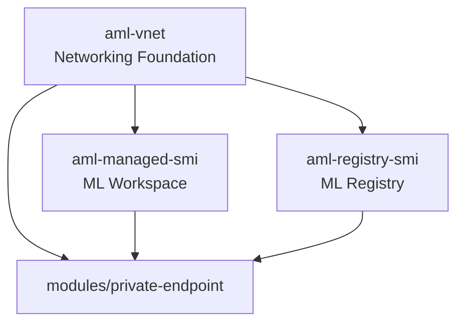
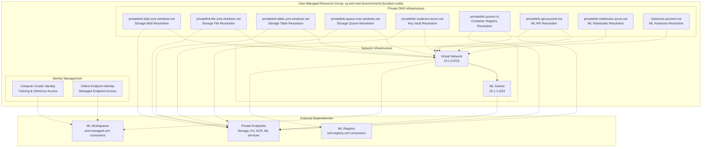

# Azure ML Virtual Network Infrastructure Module

This Terraform module deploys the foundational networking infrastructure for secure Azure Machine Learning deployments. It creates the complete networking foundation including virtual network, private DNS zones, and managed identities required for a private ML environment.

## 🎯 **Module Overview**

## 🚦 Deployment Flow & Dependencies

This module is the **foundation** for all Azure ML infrastructure. It must be deployed **first** before any dependent modules (such as `aml-managed-smi` or `aml-registry-smi`).

### Deployment Order
1. **aml-vnet** (this module): Creates networking, DNS, and managed identities
2. **aml-managed-smi**: Consumes VNet, subnet, DNS, and identity outputs to deploy the ML workspace
3. **aml-registry-smi**: Consumes VNet, DNS, and identity outputs to deploy the ML registry

### Module Dependency Diagram


### Key Outputs Consumed by Other Modules
- `resource_group_name_dns`: Used by dependent modules for resource placement
- `subnet_id`: Used for private endpoint and workspace/registry subnet assignment
- `dns_zone_*_id`: Used for private DNS zone association in downstream modules
- `cc_identity_id`, `moe_identity_id`: Used for secure identity assignment in compute and endpoints

**Note:** All dependent modules reference these outputs via Terraform remote state or module outputs. Always deploy `aml-vnet` and confirm outputs before proceeding with other modules.

This module provides the secure networking foundation for Azure ML services:

- **🌐 Network Foundation**: Virtual Network with dedicated subnet for ML resources
- **🔒 Private DNS**: Nine private DNS zones for all Azure ML and supporting services  
- **🔗 DNS Integration**: VNet links for proper private endpoint DNS resolution
- **🆔 Managed Identities**: User-assigned identities for compute clusters and online endpoints
- **🛡️ Security**: Complete network isolation for private ML deployments

## 🏗️ **Architecture**



## 📋 **Required Configuration**

### **Critical Settings to Update**

Before deploying this module, you **MUST** customize these values in `terraform.tfvars`:

#### 1. **Network Configuration** 🌐
```hcl
# Network ranges - MUST NOT conflict with existing networks
vnet_address_space     = "10.1.0.0/16"        # VNet CIDR block (65,534 IPs)
subnet_address_prefix  = "10.1.1.0/24"        # ML subnet (254 IPs)
```

**⚠️ Critical**: Verify these ranges don't overlap with:
- Existing Azure VNets in your subscription
- On-premises network ranges
- Other connected networks

#### 2. **Environment & Location** 🌍
```hcl
location               = "canadacentral"       # Azure region for deployment
location_code          = "cc"                 # Short region identifier
purpose                = "dev"                # Environment (dev/test/prod)
naming_suffix          = "01"                # Deterministic suffix for naming
```

#### 3. **Resource Tagging** 🏷️
```hcl
tags = {
  environment   = "dev"
  project      = "ml-platform" 
  owner        = "YourName"           # Update with your name
  created_by   = "terraform"
  created_date = "2025-01-28"         # Update with current date
}
```

### **Resource Naming Convention**

Resources follow this standardized pattern:
- **Resource Group**: `rg-aml-vnet-{purpose}-{location_code}`
- **VNet**: `vnet-{purpose}-{location_code}{naming_suffix}`
- **Subnet**: `snet-{purpose}-ml-{location_code}{naming_suffix}`
- **DNS Zones**: Standard Azure private DNS zone names
- **Managed Identities**: `{purpose}-mi-{type}` (cluster/endpoint)

**Example with dev environment:**
- Resource Group: `{resource-group-name}`
- VNet: `{vnet-name}`
- Subnet: `{subnet-name}`
- Managed Identity: `{managed-identity-name}`
│                    Networking Resource Group                    │
│                                                                 │
│  ┌─────────────────────────────────────────────────────────┐    │
│  │                Virtual Network                          │    │
│  │  Address Space: 10.1.0.0/16 (customizable)              │    │
│  │                                                         │    │
│  │  ┌─────────────────────────────────────────────────┐    │    │
│  │  │              ML Subnet                          │    │    │
│  │  │  Address: 10.1.1.0/24 (customizable)            │    │    │
│  │  │  - Private endpoints for ML services            │    │    │
│  │  │  - Compute clusters and endpoints               │    │    │
│  │  └─────────────────────────────────────────────────┘    │    │
│  └─────────────────────────────────────────────────────────┘    │
│                                                                 │
│  Private DNS Zones (9 zones):                                   │
│  ┌─────────────────────────────────────────────────────────┐    │
│  │  Storage Account DNS Zones:                             │    │
│  │  • privatelink.blob.core.windows.net                    │    │
│  │  • privatelink.file.core.windows.net                    │    │
│  │  • privatelink.table.core.windows.net                   │    │
│  │  • privatelink.queue.core.windows.net                   │    │
│  │                                                         │    │
│  │  Supporting Service DNS Zones:                          │    │
│  │  • privatelink.vaultcore.azure.net (Key Vault)          │    │
│  │  • privatelink.azurecr.io (Container Registry)          │    │
│  │                                                         │    │
│  │  Azure ML DNS Zones:                                    │    │
│  │  • privatelink.api.azureml.ms (ML API)                  │    │
│  │  • privatelink.notebooks.azure.net (Notebooks)          │    │
│  │  • instances.azureml.ms (Compute Instances)             │    │
│  └─────────────────────────────────────────────────────────┘    │
│                                                                 │
│  Managed Identities:                                            │
│  • Compute Cluster Identity                                     │
│  • Managed Online Endpoint Identity                             │
└─────────────────────────────────────────────────────────────────┘
```

## Security Features

- **Network Isolation**: Dedicated VNet and subnet for ML workloads
- **Private DNS**: Complete DNS resolution for private endpoints
- **Managed Identities**: Secure identity management for compute resources
- **DNS Zone Linking**: Automatic VNet linking for all private DNS zones
- **Foundation for Zero-Trust**: Network architecture supports complete private connectivity

## Resources Created

This module creates the following Azure resources:

### Core Network Infrastructure
- **Resource Group**: Container for all networking resources
- **Virtual Network**: Dedicated network for ML workloads
- **Subnet**: Dedicated subnet for ML services and private endpoints

### DNS Infrastructure (9 Private DNS Zones)
**Storage Account DNS Zones:**
- `privatelink.blob.core.windows.net` - Blob storage private connectivity
- `privatelink.file.core.windows.net` - File share private connectivity  
- `privatelink.table.core.windows.net` - Table storage private connectivity
- `privatelink.queue.core.windows.net` - Queue storage private connectivity

**Supporting Service DNS Zones:**
- `privatelink.vaultcore.azure.net` - Key Vault private connectivity
- `privatelink.azurecr.io` - Container Registry private connectivity

**Azure ML Service DNS Zones:**
- `privatelink.api.azureml.ms` - ML workspace API private connectivity
- `privatelink.notebooks.azure.net` - ML notebooks private connectivity
- `instances.azureml.ms` - ML compute instances private connectivity

### VNet Links
- **9 VNet Links**: Connect all private DNS zones to the VNet for proper name resolution

### Identity Management
- **Compute Cluster Identity**: User-assigned managed identity for ML compute clusters
- **Managed Online Endpoint Identity**: User-assigned managed identity for ML endpoints

## Prerequisites

- Azure CLI installed and authenticated
- Terraform >= 1.0 installed
- Appropriate Azure RBAC permissions to create networking resources
- Azure subscription with sufficient quota for networking resources
- Understanding of your network addressing requirements

## Deployment Steps

1. **Initialize Terraform:**
```bash
terraform init
```

2. **Review and customize terraform.tfvars:**
```bash
# Copy the example file and customize
cp terraform.tfvars.example terraform.tfvars
# Edit terraform.tfvars with your specific network configuration
```

3. **Validate network configuration:**
```bash
# Ensure your address spaces don't conflict with existing networks
az network vnet list --query "[].addressSpace.addressPrefixes" -o table
```

4. **Plan the deployment:**
```bash
terraform plan
```

5. **Apply the configuration:**
```bash
terraform apply
```

6. **Verify deployment:**
```bash
# Check VNet creation
az network vnet show --name <vnet-name> --resource-group <resource-group>

# Verify DNS zones
az network private-dns zone list --resource-group <resource-group> -o table

# Check VNet links
az network private-dns link vnet list --zone-name privatelink.api.azureml.ms --resource-group <resource-group>
```

## Post-Deployment Configuration

### Network Validation
After deployment, validate the network infrastructure:

1. **DNS Resolution Testing:**
```bash
# From a VM in the VNet, test DNS resolution
nslookup privatelink.blob.core.windows.net
nslookup privatelink.api.azureml.ms
```

2. **Connectivity Validation:**
```bash
# Verify subnet has sufficient IP addresses for your planned deployments
az network vnet subnet show --vnet-name <vnet-name> --name <subnet-name> --resource-group <resource-group>
```

3. **Identity Verification:**
```bash
# Check managed identities are created
az identity list --resource-group <resource-group> -o table
```

## Outputs

The module provides the following outputs for use by other modules:

### Network Outputs
- `resource_group_name`: Name of the networking resource group
- `resource_group_name_dns`: Name of the resource group containing DNS zones (alias for resource_group_name)
- `vnet_id`: Full resource ID of the virtual network
- `vnet_name`: Name of the virtual network
- `subnet_id`: Full resource ID of the ML subnet

### DNS Zone Outputs
- `dns_zone_blob_id`: Resource ID of blob storage DNS zone
- `dns_zone_file_id`: Resource ID of file storage DNS zone
- `dns_zone_table_id`: Resource ID of table storage DNS zone
- `dns_zone_queue_id`: Resource ID of queue storage DNS zone
- `dns_zone_keyvault_id`: Resource ID of Key Vault DNS zone
- `dns_zone_acr_id`: Resource ID of Container Registry DNS zone
- `dns_zone_aml_api_id`: Resource ID of ML API DNS zone
- `dns_zone_aml_notebooks_id`: Resource ID of ML notebooks DNS zone
- `dns_zone_aml_instances_id`: Resource ID of ML instances DNS zone

### Identity Outputs
- `cc_identity_id`: Resource ID of compute cluster managed identity
- `cc_identity_name`: Name of compute cluster managed identity (follows ${purpose}-mi-cluster pattern)
- `moe_identity_id`: Resource ID of managed online endpoint identity
- `moe_identity_name`: Name of managed online endpoint identity (follows ${purpose}-mi-endpoint pattern)

## Troubleshooting

### Common Issues

1. **Address Space Conflicts:**
   - Verify VNet address space doesn't overlap with existing networks
   - Check peering requirements if connecting to other VNets

2. **DNS Resolution Issues:**
   - Ensure all VNet links are properly created
   - Verify DNS zones are correctly named
   - Check if custom DNS servers are interfering

3. **Permission Errors:**
   - Verify you have Network Contributor permissions
   - Check subscription limits for VNets and DNS zones

4. **Resource Naming Conflicts:**
    - Ensure `naming_suffix` follows your naming standard
   - Check for existing resources with similar names

### Useful Commands

```bash
# Check VNet configuration
az network vnet show --name <vnet-name> --resource-group <resource-group>

# List all private DNS zones
az network private-dns zone list --resource-group <resource-group> -o table

# Verify VNet links for a specific DNS zone
az network private-dns link vnet list --zone-name <dns-zone-name> --resource-group <resource-group>

# Check subnet details
az network vnet subnet show --vnet-name <vnet-name> --name <subnet-name> --resource-group <resource-group>

# Verify managed identities
az identity list --resource-group <resource-group>

# Test DNS resolution (from a VM in the VNet)
nslookup privatelink.api.azureml.ms
dig @168.63.129.16 privatelink.blob.core.windows.net
```

## Clean Up

To remove all resources:

```bash
terraform destroy
```

**Warning**: This will delete the entire network infrastructure. Ensure no other resources depend on these networking components before destroying.

## Dependencies

This module has minimal external dependencies:
- Azure subscription with appropriate quotas
- Sufficient RBAC permissions for networking operations
- No conflicts with existing network address spaces

## Module Structure

```
aml-vnet/
├── main.tf                 # Main Terraform configuration
├── variables.tf            # Variable definitions
├── locals.tf               # Local value definitions
├── terraform.tfvars        # Configuration values
├── provider.tf             # Provider configuration
└── README.md              # This documentation
```

## Related Modules

This module provides foundational networking for:
- **aml-managed-smi**: Azure ML workspace with managed VNet
- **aml-registry-smi**: Azure ML registry with private connectivity
- **modules/private-endpoint**: Shared private endpoint creation

## Module Integration

This module is designed to be deployed first in a multi-module Azure ML infrastructure:

1. **Deploy `aml-vnet` first**: Creates networking foundation and managed identities
2. **Deploy `aml-managed-smi` next**: Creates ML workspace using outputs from this module

### Key Integration Points:
- **Resource Group**: The `resource_group_name_dns` output is used by dependent modules
- **Subnet**: The `subnet_id` output provides the target for private endpoints
- **DNS Zones**: All DNS zone outputs enable private endpoint DNS resolution
- **Managed Identities**: Identity outputs provide secure compute authentication
- **Naming Consistency**: Uses `${purpose}-mi-cluster` pattern for predictable identity names

## Best Practices

1. **Network Planning**: Carefully plan address spaces to avoid future conflicts
2. **DNS Management**: Maintain consistent DNS zone naming across environments
3. **Security**: Use private endpoints for all Azure services
4. **Monitoring**: Enable network monitoring and flow logs
5. **Documentation**: Document network topology and addressing scheme
6. **Standardization**: Use consistent naming and tagging across environments

## Network Planning Guidelines

### DNS Zone Requirements

All 9 private DNS zones are required for complete Azure ML functionality:
- Storage zones enable private access to ML data and artifacts
- Key Vault zone secures secrets and certificates
- Container Registry zone protects ML container images
- ML-specific zones enable private workspace and compute access

---

**Authors**: Jose Medina Gomez & Matt Felton  
**Last Updated**: July 29, 2025  
**Version**: 1.4.0 - Production-Ready Diagnostic Settings Deployment
